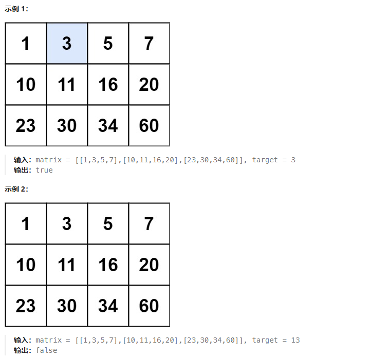
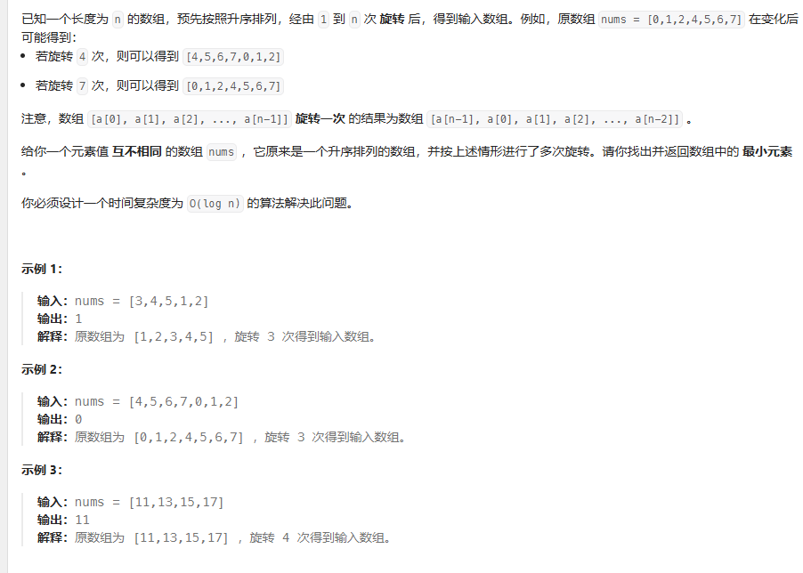

# 二分查找

## 35 搜索插入位置
问题：
给定一个排序数组和一个目标值，在数组中找到目标值，并返回其索引。如果目标值不存在于数组中，返回它将会被按顺序插入的位置。
请必须使用时间复杂度为 O(log n) 的算法。
示例 1:

输入: nums = [1,3,5,6], target = 5
输出: 2
示例 2:

输入: nums = [1,3,5,6], target = 2
输出: 1
示例 3:

输入: nums = [1,3,5,6], target = 7
输出: 4

二分查找
class Solution {
public:
    int searchInsert(vector<int>& nums, int target) {
        int n = nums.size();
        int left = 0, right = n - 1, ans = n;
        while (left <= right) {
            int mid = ((right - left) >> 1) + left;
            if (target <= nums[mid]) {
                ans = mid;
                right = mid - 1;
            } else {
                left = mid + 1;
            }
        }
        return ans;
    }
};

注释1：使用 while (left <= right) 作为循环条件，这是二分搜索的标准做法。
注释2：int mid = ((right - left) >> 1) + left;：计算中间索引。这里使用了无符号右移（>>），这是一种避免整数溢出的技巧，等价于 (right + left) / 2 但更安全。

## 74 搜索二维矩阵
给你一个满足下述两条属性的 m x n 整数矩阵：
每行中的整数从左到右按非严格递增顺序排列。
每行的第一个整数大于前一行的最后一个整数。
给你一个整数 target ，如果 target 在矩阵中，返回 true ；否则，返回 false 。

两次二分查找
class Solution {
public:
    bool searchMatrix(vector<vector<int>> matrix, int target) {
        auto row = upper_bound(matrix.begin(), matrix.end(), target,  {
            return b < a[0];
        });
        if (row == matrix.begin()) {
            return false;
        }
        --row;
        return binary_search(row->begin(), row->end(), target);
    }
};

一次二分查找
class Solution {
public:
    bool searchMatrix(vector<vector<int>>& matrix, int target) {
        int m = matrix.size(), n = matrix[0].size();
        int low = 0, high = m * n - 1;
        while (low <= high) {
            int mid = (high - low) / 2 + low;
            int x = matrix[mid / n][mid % n];
            if (x < target) {
                low = mid + 1;
            } else if (x > target) {
                high = mid - 1;
            } else {
                return true;
            }
        }
        return false;
    }
};

## 34 查找排序数组的首末元素

给你一个按照非递减顺序排列的整数数组 nums，和一个目标值 target。请你找出给定目标值在数组中的开始位置和结束位置。
如果数组中不存在目标值 target，返回 [-1, -1]。
你必须设计并实现时间复杂度为 O(log n) 的算法解决此问题。
示例 1：

输入：nums = [5,7,7,8,8,10], target = 8
输出：[3,4]
示例 2：

输入：nums = [5,7,7,8,8,10], target = 6
输出：[-1,-1]
示例 3：

输入：nums = [], target = 0
输出：[-1,-1]

二分查找
class Solution { 
public:
    int binarySearch(vector<int>& nums, int target, bool lower) {
        int left = 0, right = (int)nums.size() - 1, ans = (int)nums.size();
        while (left <= right) {
            int mid = (left + right) / 2;
            if (nums[mid] > target || (lower && nums[mid] >= target)) {
                right = mid - 1;
                ans = mid;
            } else {
                left = mid + 1;
            }
        }
        return ans;
    }

    vector<int> searchRange(vector<int>& nums, int target) {
        int leftIdx = binarySearch(nums, target, true);
        int rightIdx = binarySearch(nums, target, false) - 1;
        if (leftIdx <= rightIdx && rightIdx < nums.size() && nums[leftIdx] == target && nums[rightIdx] == target) {
            return vector<int>{leftIdx, rightIdx};
        } 
        return vector<int>{-1, -1};
    }
};

## 33 搜索旋转排序数组
问题：
整数数组 nums 按升序排列，数组中的值 互不相同 。
在传递给函数之前，nums 在预先未知的某个下标 k（0 <= k < nums.length）上进行了 旋转，使数组变为 [nums[k], nums[k+1], ..., nums[n-1], nums[0], nums[1], ..., nums[k-1]]（下标 从 0 开始 计数）。例如， [0,1,2,4,5,6,7] 在下标 3 处经旋转后可能变为 [4,5,6,7,0,1,2] 。
给你 旋转后 的数组 nums 和一个整数 target ，如果 nums 中存在这个目标值 target ，则返回它的下标，否则返回 -1 。
你必须设计一个时间复杂度为 O(log n) 的算法解决此问题。
示例 1：

输入：nums = [4,5,6,7,0,1,2], target = 0
输出：4
示例 2：

输入：nums = [4,5,6,7,0,1,2], target = 3
输出：-1
示例 3：

输入：nums = [1], target = 0
输出：-1

class Solution {
public:
    int search(vector<int>& nums, int target) {
        int n = (int)nums.size();
        if (!n) {
            return -1;
        }
        if (n == 1) {
            return nums[0] == target ? 0 : -1;
        }
        int l = 0, r = n - 1;
        while (l <= r) {
            int mid = (l + r) / 2;
            if (nums[mid] == target) return mid;
            if (nums[0] <= nums[mid]) {
                if (nums[0] <= target && target < nums[mid]) {
                    r = mid - 1;
                } else {
                    l = mid + 1;
                }
            } else {
                if (nums[mid] < target && target <= nums[n - 1]) {
                    l = mid + 1;
                } else {
                    r = mid - 1;
                }
            }
        }
        return -1;
    }
};

## 153 搜索旋转排序数组中的最小值

二分查找
class Solution {
public:
    int findMin(vector<int>& nums) {
        int low = 0;
        int high = nums.size() - 1;
        while (low < high) {
            int pivot = low + (high - low) / 2;
            if (nums[pivot] < nums[high]) {
                high = pivot;
            }
            else {
                low = pivot + 1;
            }
        }
        return nums[low];
    }
};

## 4 寻找两个正序数组的中位数

问题：
给定两个大小分别为 m 和 n 的正序（从小到大）数组 nums1 和 nums2。请你找出并返回这两个正序数组的 中位数 。
算法的时间复杂度应该为 O(log (m+n)) 。

示例 1：
输入：nums1 = [1,3], nums2 = [2]
输出：2.00000
解释：合并数组 = [1,2,3] ，中位数 2
示例 2：
输入：nums1 = [1,2], nums2 = [3,4]
输出：2.50000
解释：合并数组 = [1,2,3,4] ，中位数 (2 + 3) / 2 = 2.5

二分查找
class Solution {
public:
    int getKthElement(const vector<int>& nums1, const vector<int>& nums2, int k) {
        /* 主要思路：要找到第 k (k>1) 小的元素，那么就取 pivot1 = nums1[k/2-1] 和 pivot2 = nums2[k/2-1] 进行比较
         * 这里的 "/" 表示整除
         * nums1 中小于等于 pivot1 的元素有 nums1[0 .. k/2-2] 共计 k/2-1 个
         * nums2 中小于等于 pivot2 的元素有 nums2[0 .. k/2-2] 共计 k/2-1 个
         * 取 pivot = min(pivot1, pivot2)，两个数组中小于等于 pivot 的元素共计不会超过 (k/2-1) + (k/2-1) <= k-2 个
         * 这样 pivot 本身最大也只能是第 k-1 小的元素
         * 如果 pivot = pivot1，那么 nums1[0 .. k/2-1] 都不可能是第 k 小的元素。把这些元素全部 "删除"，剩下的作为新的 nums1 数组
         * 如果 pivot = pivot2，那么 nums2[0 .. k/2-1] 都不可能是第 k 小的元素。把这些元素全部 "删除"，剩下的作为新的 nums2 数组
         * 由于我们 "删除" 了一些元素（这些元素都比第 k 小的元素要小），因此需要修改 k 的值，减去删除的数的个数
         */

        int m = nums1.size();
        int n = nums2.size();
        int index1 = 0, index2 = 0;

        while (true) {
            // 边界情况
            if (index1 == m) {
                return nums2[index2 + k - 1];
            }
            if (index2 == n) {
                return nums1[index1 + k - 1];
            }
            if (k == 1) {
                return min(nums1[index1], nums2[index2]);
            }

            // 正常情况
            int newIndex1 = min(index1 + k / 2 - 1, m - 1);
            int newIndex2 = min(index2 + k / 2 - 1, n - 1);
            int pivot1 = nums1[newIndex1];
            int pivot2 = nums2[newIndex2];
            if (pivot1 <= pivot2) {
                k -= newIndex1 - index1 + 1;
                index1 = newIndex1 + 1;
            }
            else {
                k -= newIndex2 - index2 + 1;
                index2 = newIndex2 + 1;
            }
        }
    }

    double findMedianSortedArrays(vector<int>& nums1, vector<int>& nums2) {
        int totalLength = nums1.size() + nums2.size();
        if (totalLength % 2 == 1) {
            return getKthElement(nums1, nums2, (totalLength + 1) / 2);
        }
        else {
            return (getKthElement(nums1, nums2, totalLength / 2) + getKthElement(nums1, nums2, totalLength / 2 + 1)) / 2.0;
        }
    }
};

划分数组
class Solution {
public:
    double findMedianSortedArrays(vector<int>& nums1, vector<int>& nums2) {
        if (nums1.size() > nums2.size()) {
            return findMedianSortedArrays(nums2, nums1);
        }
        
        int m = nums1.size();
        int n = nums2.size();
        int left = 0, right = m;
        // median1：前一部分的最大值
        // median2：后一部分的最小值
        int median1 = 0, median2 = 0;

        while (left <= right) {
            // 前一部分包含 nums1[0 .. i-1] 和 nums2[0 .. j-1]
            // 后一部分包含 nums1[i .. m-1] 和 nums2[j .. n-1]
            int i = (left + right) / 2;
            int j = (m + n + 1) / 2 - i;

            // nums_im1, nums_i, nums_jm1, nums_j 分别表示 nums1[i-1], nums1[i], nums2[j-1], nums2[j]
            int nums_im1 = (i == 0 ? INT_MIN : nums1[i - 1]);
            int nums_i = (i == m ? INT_MAX : nums1[i]);
            int nums_jm1 = (j == 0 ? INT_MIN : nums2[j - 1]);
            int nums_j = (j == n ? INT_MAX : nums2[j]);

            if (nums_im1 <= nums_j) {
                median1 = max(nums_im1, nums_jm1);
                median2 = min(nums_i, nums_j);
                left = i + 1;
            } else {
                right = i - 1;
            }
        }

        return (m + n) % 2 == 0 ? (median1 + median2) / 2.0 : median1;
    }
};

