# 二叉树

## 94 二叉树的中序遍历
问题：
给定一个二叉树的根节点 root ，返回 它的 中序 遍历 。
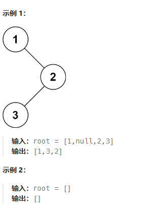

递归
class Solution {
public:
    void inorder(TreeNode* root, vector<int>& res) {
        if (!root) {
            return;
        }
        inorder(root->left, res);
        res.push_back(root->val);
        inorder(root->right, res);
    }
    vector<int> inorderTraversal(TreeNode* root) {
        vector<int> res;
        inorder(root, res);
        return res;
    }
};

迭代
class Solution {
public:
    vector<int> inorderTraversal(TreeNode* root) {
        vector<int> res;
        stack<TreeNode*> stk;
        while (root != nullptr || !stk.empty()) {
            while (root != nullptr) {
                stk.push(root);
                root = root->left;
            }
            root = stk.top();
            stk.pop();
            res.push_back(root->val);
            root = root->right;
        }
        return res;
    }
};

## 104 二叉树的最大深度
问题：
给定一个二叉树 root ，返回其最大深度。二叉树的 最大深度 是指从根节点到最远叶子节点的最长路径上的节点数。
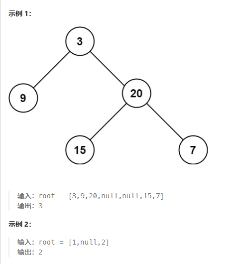

深度优先搜索
class Solution {
public:
    int maxDepth(TreeNode* root) {
        if (root == nullptr) return 0;
        return max(maxDepth(root->left), maxDepth(root->right)) + 1;
    }
};

广度优先搜索
class Solution {
public:
    int maxDepth(TreeNode* root) {
        if (root == nullptr) return 0;
        queue<TreeNode*> Q;
        Q.push(root);
        int ans = 0;
        while (!Q.empty()) {
            int sz = Q.size();
            while (sz > 0) {
                TreeNode* node = Q.front();Q.pop();
                if (node->left) Q.push(node->left);
                if (node->right) Q.push(node->right);
                sz -= 1;
            }
            ans += 1;
        } 
        return ans;
    }
};

## 226 反转二叉树
问题：
给你一棵二叉树的根节点 root ，翻转这棵二叉树，并返回其根节点。
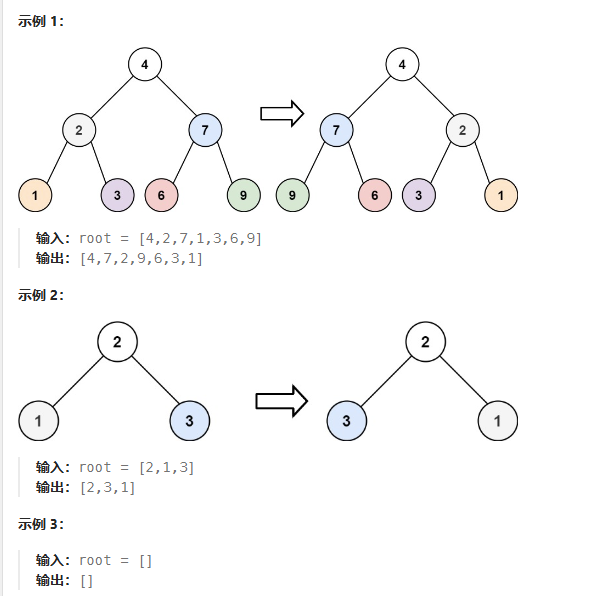

递归
class Solution {
public:
    TreeNode* invertTree(TreeNode* root) {
        if (root == nullptr) {
            return nullptr;
        }
        TreeNode* left = invertTree(root->left);
        TreeNode* right = invertTree(root->right);
        root->left = right;
        root->right = left;
        return root;
    }
};

辅助栈
class Solution {
public:
    TreeNode* invertTree(TreeNode* root) {
        if (root == nullptr) return nullptr;
        stack<TreeNode*> stack;
        stack.push(root);
        while (!stack.empty())
        {
            TreeNode* node = stack.top();
            stack.pop();
            if (node->left != nullptr) stack.push(node->left);
            if (node->right != nullptr) stack.push(node->right);
            TreeNode* tmp = node->left;
            node->left = node->right;
            node->right = tmp;
        }
        return root;
    }
};

## 101 对称二叉树
问题：
给你一个二叉树的根节点 root ， 检查它是否轴对称。
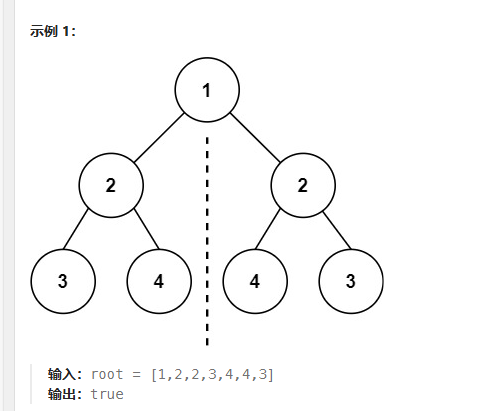

递归
class Solution {
public:
    bool check(TreeNode *p, TreeNode *q) {
        if (!p && !q) return true;
        if (!p || !q) return false;
        return p->val == q->val && check(p->left, q->right) && check(p->right, q->left);
    }

    bool isSymmetric(TreeNode* root) {
        return check(root, root);
    }
};

迭代
class Solution {
public:
    bool check(TreeNode *u, TreeNode *v) {
        queue <TreeNode*> q;
        q.push(u); q.push(v);
        while (!q.empty()) {
            u = q.front(); q.pop();
            v = q.front(); q.pop();
            if (!u && !v) continue;
            if ((!u || !v) || (u->val != v->val)) return false;

            q.push(u->left); 
            q.push(v->right);

            q.push(u->right); 
            q.push(v->left);
        }
        return true;
    }

    bool isSymmetric(TreeNode* root) {
        return check(root, root);
    }
};

## 543 二叉树的直径

问题：
给你一棵二叉树的根节点，返回该树的 直径 。
二叉树的 直径 是指树中任意两个节点之间最长路径的 长度 。这条路径可能经过也可能不经过根节点 root 。
两节点之间路径的 长度 由它们之间边数表示。
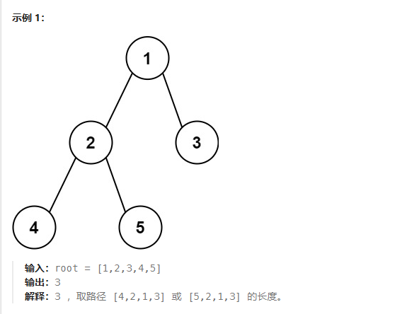

深度优先算法
class Solution {
    int ans;
    int depth(TreeNode* rt){
        if (rt == NULL) {
            return 0; // 访问到空节点了，返回0
        }
        int L = depth(rt->left); // 左儿子为根的子树的深度
        int R = depth(rt->right); // 右儿子为根的子树的深度
        ans = max(ans, L + R + 1); // 计算d_node即L+R+1 并更新ans
        return max(L, R) + 1; // 返回该节点为根的子树的深度
    }
public:
    int diameterOfBinaryTree(TreeNode* root) {
        ans = 1;
        depth(root);
        return ans - 1;
    }
};

class Solution {
    int ans;
    int depth(TreeNode* root){
        if (root == NULL) return 0;
        int L = depth(root->left);
        int R = depth(root->right);
        ans = max(ans, L + R + 1);
        return max(L, R) + 1;
    }
public:
    int diameterOfBinaryTree(TreeNode* root) {
        ans = 1;
        depth(root);
        return ans - 1;
    }
};

## 102 二叉树的层序遍历
给你二叉树的根节点 root ，返回其节点值的 层序遍历 。 （即逐层地，从左到右访问所有节点）
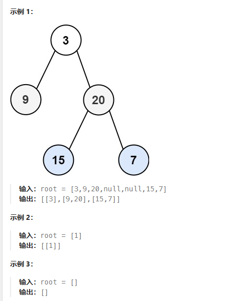

广度优先搜索
class Solution {
public:
    vector<vector<int>> levelOrder(TreeNode* root) {
        vector <vector <int>> ret;
        if (!root) {
            return ret;
        }

        queue <TreeNode*> q;
        q.push(root);
        while (!q.empty()) {
            int currentLevelSize = q.size();
            ret.push_back(vector <int> ());
            for (int i = 1; i <= currentLevelSize; ++i) {
                auto node = q.front(); q.pop();
                ret.back().push_back(node->val);
                if (node->left) q.push(node->left);
                if (node->right) q.push(node->right);
            }
        }
        
        return ret;
    }
};

class Solution {
public:
    vector<vector<int>> levelOrder(TreeNode* root) {
        queue<TreeNode*> que;
        vector<vector<int>> res;
        if (root != nullptr) que.push(root);
        while (!que.empty()) {
            vector<int> tmp;
            for(int i = que.size(); i > 0; --i) {
                root = que.front();
                que.pop();
                tmp.push_back(root->val);
                if (root->left != nullptr) que.push(root->left);
                if (root->right != nullptr) que.push(root->right);
            }
            res.push_back(tmp);
        }
        return res;
    }
};

## 108 将有序数组转化为二叉搜索树
问题：
给你一个整数数组 nums ，其中元素已经按 升序 排列，请你将其转换为一棵 平衡二叉搜索树。
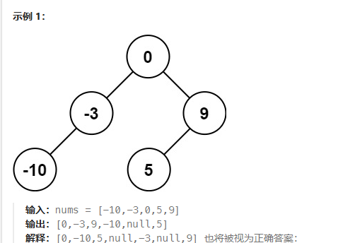

中序遍历
class Solution {
public:
    TreeNode* sortedArrayToBST(vector<int>& nums) {
        return helper(nums, 0, nums.size() - 1);
    }

    TreeNode* helper(vector<int>& nums, int left, int right) {
        if (left > right) {
            return nullptr;
        }

        // 总是选择中间位置左边的数字作为根节点
        int mid = (left + right) / 2;

        TreeNode* root = new TreeNode(nums[mid]);
        root->left = helper(nums, left, mid - 1);
        root->right = helper(nums, mid + 1, right);
        return root;
    }
};

class Solution {
public:
    TreeNode* sortedArrayToBST(vector<int>& nums) {
        return helper(nums, 0, nums.size() - 1);
    }

    TreeNode* helper(vector<int>& nums, int left, int right) {
        if (left > right) {
            return nullptr;
        }

        // 总是选择中间位置右边的数字作为根节点
        int mid = (left + right + 1) / 2;

        TreeNode* root = new TreeNode(nums[mid]);
        root->left = helper(nums, left, mid - 1);
        root->right = helper(nums, mid + 1, right);
        return root;
    }
};

## 98 验证二叉搜索树
问题：
给你一个二叉树的根节点 root ，判断其是否是一个有效的二叉搜索树。
有效 二叉搜索树定义如下：
节点的左子树
只包含 小于 当前节点的数。
节点的右子树只包含 大于 当前节点的数。
所有左子树和右子树自身必须也是二叉搜索树。
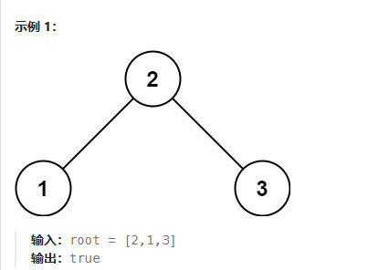

递归
class Solution {
public:
    bool helper(TreeNode* root, long long lower, long long upper) {
        if (root == nullptr) {
            return true;
        }
        if (root -> val <= lower || root -> val >= upper) {
            return false;
        }
        return helper(root -> left, lower, root -> val) && helper(root -> right, root -> val, upper);
    }
    bool isValidBST(TreeNode* root) {
        return helper(root, LONG_MIN, LONG_MAX);
    }
};

中序遍历
class Solution {
public:
    bool isValidBST(TreeNode* root) {
        stack<TreeNode*> stack;
        long long inorder = (long long)INT_MIN - 1;

        while (!stack.empty() || root != nullptr) {
            while (root != nullptr) {
                stack.push(root);
                root = root -> left;
            }
            root = stack.top();
            stack.pop();
            // 如果中序遍历得到的节点的值小于等于前一个 inorder，说明不是二叉搜索树
            if (root -> val <= inorder) {
                return false;
            }
            inorder = root -> val;
            root = root -> right;
        }
        return true;
    }
};

## 230 二叉搜索树中第k小的元素
问题：
给定一个二叉搜索树的根节点 root ，和一个整数 k ，请你设计一个算法查找其中第 k 个最小元素（从 1 开始计数）。
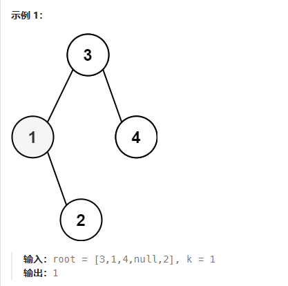

中序遍历
class Solution {
public:
    int kthSmallest(TreeNode* root, int k) {
        stack<TreeNode *> stack;
        while (root != nullptr || stack.size() > 0) {
            while (root != nullptr) {
                stack.push(root);
                root = root->left;
            }
            root = stack.top();
            stack.pop();
            --k;
            if (k == 0) {
                break;
            }
            root = root->right;
        }
        return root->val;
    }
};

class Solution {
public:
    int kthSmallest(TreeNode* root, int k) {
        this->k = k;
        dfs(root);
        return res;
    }
private:
    int res, k;
    void dfs(TreeNode* root) {
        if (root == nullptr) return;
        dfs(root->left);
        if (k == 0) return;
        if (--k == 0) res = root->val;
        dfs(root->right);
    }
};

## 199 二叉树的右视图
问题：
给定一个二叉树的 根节点 root，想象自己站在它的右侧，按照从顶部到底部的顺序，返回从右侧所能看到的节点值。
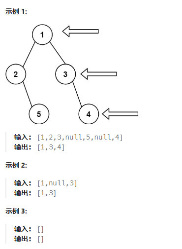

深度优先搜索
class Solution {
public:
    vector<int> rightSideView(TreeNode* root) {
        unordered_map<int, int> rightmostValueAtDepth;
        int max_depth = -1;

        stack<TreeNode*> nodeStack;
        stack<int> depthStack;
        nodeStack.push(root);
        depthStack.push(0);

        while (!nodeStack.empty()) {
            TreeNode* node = nodeStack.top();nodeStack.pop();
            int depth = depthStack.top();depthStack.pop();

            if (node != NULL) {
            	// 维护二叉树的最大深度
                max_depth = max(max_depth, depth);

                // 如果不存在对应深度的节点我们才插入
                if (rightmostValueAtDepth.find(depth) == rightmostValueAtDepth.end()) {
                    rightmostValueAtDepth[depth] =  node -> val;
                }

                nodeStack.push(node -> left);
                nodeStack.push(node -> right);
                depthStack.push(depth + 1);
                depthStack.push(depth + 1);
            }
        }

        vector<int> rightView;
        for (int depth = 0; depth <= max_depth; ++depth) {
            rightView.push_back(rightmostValueAtDepth[depth]);
        }

        return rightView;
    }
};

广度优先搜索
class Solution {
public:
    vector<int> rightSideView(TreeNode* root) {
        unordered_map<int, int> rightmostValueAtDepth;
        int max_depth = -1;

        queue<TreeNode*> nodeQueue;
        queue<int> depthQueue;
        nodeQueue.push(root);
        depthQueue.push(0);

        while (!nodeQueue.empty()) {
            TreeNode* node = nodeQueue.front();nodeQueue.pop();
            int depth = depthQueue.front();depthQueue.pop();

            if (node != NULL) {
            	// 维护二叉树的最大深度
                max_depth = max(max_depth, depth);

                // 由于每一层最后一个访问到的节点才是我们要的答案，因此不断更新对应深度的信息即可
                rightmostValueAtDepth[depth] =  node -> val;

                nodeQueue.push(node -> left);
                nodeQueue.push(node -> right);
                depthQueue.push(depth + 1);
                depthQueue.push(depth + 1);
            }
        }

        vector<int> rightView;
        for (int depth = 0; depth <= max_depth; ++depth) {
            rightView.push_back(rightmostValueAtDepth[depth]);
        }

        return rightView;
    }
};

## 114 二叉树展开为链表
问题：
给你二叉树的根结点 root ，请你将它展开为一个单链表：
展开后的单链表应该同样使用 TreeNode ，其中 right 子指针指向链表中下一个结点，而左子指针始终为 null 。
展开后的单链表应该与二叉树 先序遍历 顺序相同。
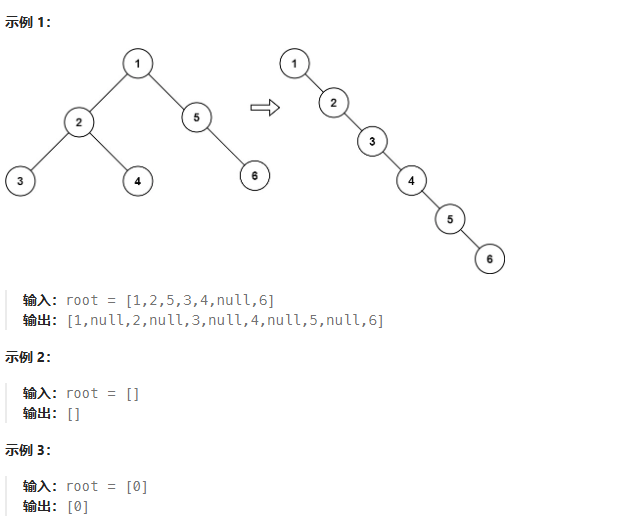

前序遍历
class Solution {
public:
    void flatten(TreeNode* root) {
        vector<TreeNode*> l;
        preorderTraversal(root, l);
        int n = l.size();
        for (int i = 1; i < n; i++) {
            TreeNode *prev = l.at(i - 1), *curr = l.at(i);
            prev->left = nullptr;
            prev->right = curr;
        }
    }

    void preorderTraversal(TreeNode* root, vector<TreeNode*> &l) {
        if (root != NULL) {
            l.push_back(root);
            preorderTraversal(root->left, l);
            preorderTraversal(root->right, l);
        }
    }
};

class Solution {
public:
    void flatten(TreeNode* root) {
        auto v = vector<TreeNode*>();
        auto stk = stack<TreeNode*>();
        TreeNode *node = root;
        while (node != nullptr || !stk.empty()) {
            while (node != nullptr) {
                v.push_back(node);
                stk.push(node);
                node = node->left;
            }
            node = stk.top(); stk.pop();
            node = node->right;
        }
        int size = v.size();
        for (int i = 1; i < size; i++) {
            auto prev = v.at(i - 1), curr = v.at(i);
            prev->left = nullptr;
            prev->right = curr;
        }
    }
};

前序和展开同步进行
class Solution {
public:
    void flatten(TreeNode* root) {
        if (root == nullptr) {
            return;
        }
        auto stk = stack<TreeNode*>();
        stk.push(root);
        TreeNode *prev = nullptr;
        while (!stk.empty()) {
            TreeNode *curr = stk.top(); stk.pop();
            if (prev != nullptr) {
                prev->left = nullptr;
                prev->right = curr;
            }
            TreeNode *left = curr->left, *right = curr->right;
            if (right != nullptr) {
                stk.push(right);
            }
            if (left != nullptr) {
                stk.push(left);
            }
            prev = curr;
        }
    }
};

## 105 从前序与中序中构造二叉树
问题：
给定两个整数数组 preorder 和 inorder ，其中 preorder 是二叉树的先序遍历， inorder 是同一棵树的中序遍历，请构造二叉树并返回其根节点。
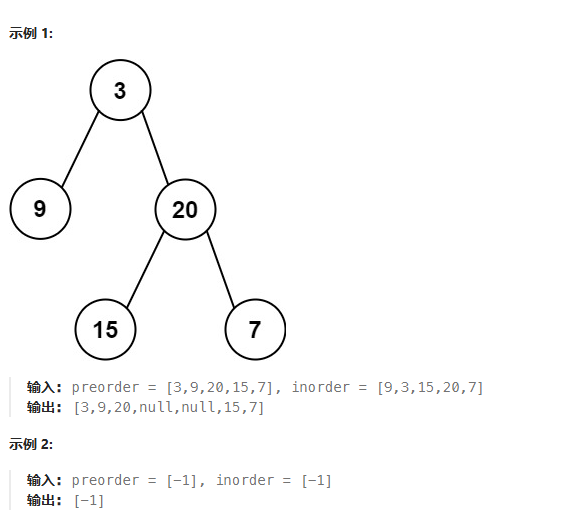

递归
class Solution {
private:
    unordered_map<int, int> index;

public:
    TreeNode* myBuildTree(const vector<int>& preorder, const vector<int>& inorder, int preorder_left, int preorder_right, int inorder_left, int inorder_right) {
        if (preorder_left > preorder_right) {
            return nullptr;
        }
        
        // 前序遍历中的第一个节点就是根节点
        int preorder_root = preorder_left;
        // 在中序遍历中定位根节点
        int inorder_root = index[preorder[preorder_root]];
        
        // 先把根节点建立出来
        TreeNode* root = new TreeNode(preorder[preorder_root]);
        // 得到左子树中的节点数目
        int size_left_subtree = inorder_root - inorder_left;
        // 递归地构造左子树，并连接到根节点
        // 先序遍历中「从 左边界+1 开始的 size_left_subtree」个元素就对应了中序遍历中「从 左边界 开始到 根节点定位-1」的元素
        root->left = myBuildTree(preorder, inorder, preorder_left + 1, preorder_left + size_left_subtree, inorder_left, inorder_root - 1);
        // 递归地构造右子树，并连接到根节点
        // 先序遍历中「从 左边界+1+左子树节点数目 开始到 右边界」的元素就对应了中序遍历中「从 根节点定位+1 到 右边界」的元素
        root->right = myBuildTree(preorder, inorder, preorder_left + size_left_subtree + 1, preorder_right, inorder_root + 1, inorder_right);
        return root;
    }

    TreeNode* buildTree(vector<int>& preorder, vector<int>& inorder) {
        int n = preorder.size();
        // 构造哈希映射，帮助我们快速定位根节点
        for (int i = 0; i < n; ++i) {
            index[inorder[i]] = i;
        }
        return myBuildTree(preorder, inorder, 0, n - 1, 0, n - 1);
    }
};

迭代
class Solution {
public:
    TreeNode* buildTree(vector<int>& preorder, vector<int>& inorder) {
        if (!preorder.size()) {
            return nullptr;
        }
        TreeNode* root = new TreeNode(preorder[0]);
        stack<TreeNode*> stk;
        stk.push(root);
        int inorderIndex = 0;
        for (int i = 1; i < preorder.size(); ++i) {
            int preorderVal = preorder[i];
            TreeNode* node = stk.top();
            if (node->val != inorder[inorderIndex]) {
                node->left = new TreeNode(preorderVal);
                stk.push(node->left);
            }
            else {
                while (!stk.empty() && stk.top()->val == inorder[inorderIndex]) {
                    node = stk.top();
                    stk.pop();
                    ++inorderIndex;
                }
                node->right = new TreeNode(preorderVal);
                stk.push(node->right);
            }
        }
        return root;
    }
};

## 437 路径总和3
给定一个二叉树的根节点 root ，和一个整数 targetSum ，求该二叉树里节点值之和等于 targetSum 的 路径 的数目。路径 不需要从根节点开始，也不需要在叶子节点结束，但是路径方向必须是向下的（只能从父节点到子节点）。
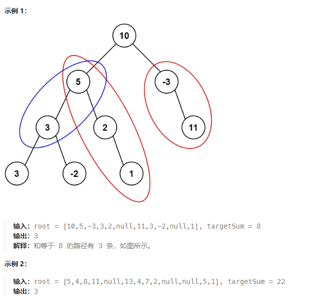

深度优先搜索
class Solution {
public:
    int rootSum(TreeNode* root, int targetSum) {
        if (!root) {
            return 0;
        }

        int ret = 0;
        if (root->val == targetSum) {
            ret++;
        } 

        ret += rootSum(root->left, targetSum - root->val);
        ret += rootSum(root->right, targetSum - root->val);
        return ret;
    }

    int pathSum(TreeNode* root, int targetSum) {
        if (!root) {
            return 0;
        }
        
        int ret = rootSum(root, targetSum);
        ret += pathSum(root->left, targetSum);
        ret += pathSum(root->right, targetSum);
        return ret;
    }
};

前缀和
class Solution {
public:
    unordered_map<long long, int> prefix;

    int dfs(TreeNode *root, long long curr, int targetSum) {
        if (!root) {
            return 0;
        }

        int ret = 0;
        curr += root->val;
        if (prefix.count(curr - targetSum)) {
            ret = prefix[curr - targetSum];
        }

        prefix[curr]++;
        ret += dfs(root->left, curr, targetSum);
        ret += dfs(root->right, curr, targetSum);
        prefix[curr]--;

        return ret;
    }

    int pathSum(TreeNode* root, int targetSum) {
        prefix[0] = 1;
        return dfs(root, 0, targetSum);
    }
};

## 236 二叉树的最近公共祖先
问题：
给定一个二叉树, 找到该树中两个指定节点的最近公共祖先。
百度百科中最近公共祖先的定义为：“对于有根树 T 的两个节点 p、q，最近公共祖先表示为一个节点 x，满足 x 是 p、q 的祖先且 x 的深度尽可能大（一个节点也可以是它自己的祖先）。”
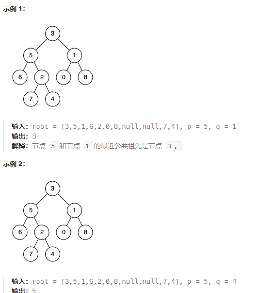

递归
class Solution {
public:
    TreeNode* ans;
    bool dfs(TreeNode* root, TreeNode* p, TreeNode* q) {
        if (root == nullptr) return false;
        bool lson = dfs(root->left, p, q);
        bool rson = dfs(root->right, p, q);
        if ((lson && rson) || ((root->val == p->val || root->val == q->val) && (lson || rson))) {
            ans = root;
        } 
        return lson || rson || (root->val == p->val || root->val == q->val);
    }
    TreeNode* lowestCommonAncestor(TreeNode* root, TreeNode* p, TreeNode* q) {
        dfs(root, p, q);
        return ans;
    }
};

存储父节点
class Solution {
public:
    unordered_map<int, TreeNode*> fa;
    unordered_map<int, bool> vis;
    void dfs(TreeNode* root){
        if (root->left != nullptr) {
            fa[root->left->val] = root;
            dfs(root->left);
        }
        if (root->right != nullptr) {
            fa[root->right->val] = root;
            dfs(root->right);
        }
    }
    TreeNode* lowestCommonAncestor(TreeNode* root, TreeNode* p, TreeNode* q) {
        fa[root->val] = nullptr;
        dfs(root);
        while (p != nullptr) {
            vis[p->val] = true;
            p = fa[p->val];
        }
        while (q != nullptr) {
            if (vis[q->val]) return q;
            q = fa[q->val];
        }
        return nullptr;
    }
};

## 124 二叉树中的最大路径和
问题：
二叉树中的 路径 被定义为一条节点序列，序列中每对相邻节点之间都存在一条边。同一个节点在一条路径序列中 至多出现一次 。该路径 至少包含一个 节点，且不一定经过根节点。
路径和 是路径中各节点值的总和。
给你一个二叉树的根节点 root ，返回其 最大路径和 。
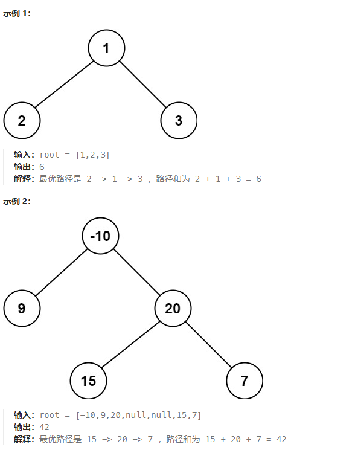

递归
class Solution {
private:
    int maxSum = INT_MIN;

public:
    int maxGain(TreeNode* node) {
        if (node == nullptr) {
            return 0;
        }
        
        // 递归计算左右子节点的最大贡献值
        // 只有在最大贡献值大于 0 时，才会选取对应子节点
        int leftGain = max(maxGain(node->left), 0);
        int rightGain = max(maxGain(node->right), 0);

        // 节点的最大路径和取决于该节点的值与该节点的左右子节点的最大贡献值
        int priceNewpath = node->val + leftGain + rightGain;

        // 更新答案
        maxSum = max(maxSum, priceNewpath);

        // 返回节点的最大贡献值
        return node->val + max(leftGain, rightGain);
    }

    int maxPathSum(TreeNode* root) {
        maxGain(root);
        return maxSum;
    }
};

int maxPathSum(TreeNode* root, int &val)
{
	if (root == nullptr) return 0;
	int left = maxPathSum(root->left, val);
	int right = maxPathSum(root->right, val);
	int lmr = root->val + max(0, left) + max(0, right);
	int ret = root->val + max(0, max(left, right));
	val = max(val, max(lmr, ret));
	return ret;
}

int maxPathSum(TreeNode* root) 
{
	int val = INT_MIN;
	maxPathSum(root, val);
	return val;
}

