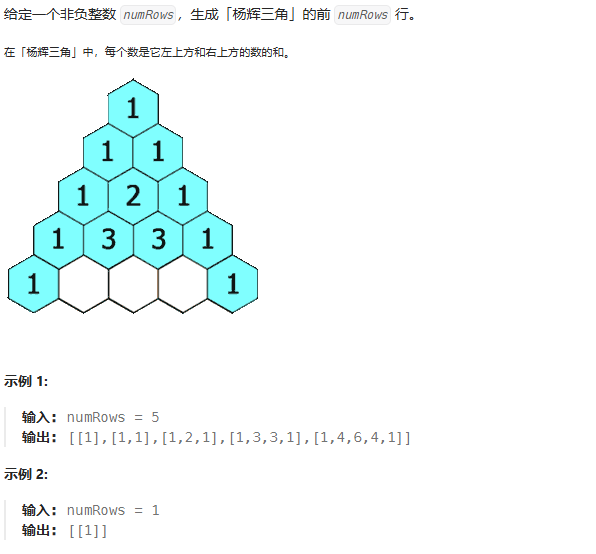

# 动态规划
## 70 爬楼梯
假设你正在爬楼梯。需要 n 阶你才能到达楼顶。
每次你可以爬 1 或 2 个台阶。你有多少种不同的方法可以爬到楼顶呢？
 
示例 1：

输入：n = 2
输出：2
解释：有两种方法可以爬到楼顶。
1. 1 阶 + 1 阶
2. 2 阶
示例 2：

输入：n = 3
输出：3
解释：有三种方法可以爬到楼顶。
1. 1 阶 + 1 阶 + 1 阶
2. 1 阶 + 2 阶
3. 2 阶 + 1 阶
   
动态规划
class Solution {
public:
    int climbStairs(int n) {
        int p = 0, q = 0, r = 1;
        for (int i = 1; i <= n; ++i) {
            p = q; 
            q = r; 
            r = p + q;
        }
        return r;
    }
};

通项公式
class Solution {
public:
    int climbStairs(int n) {
        double sqrt5 = sqrt(5);
        double fibn = pow((1 + sqrt5) / 2, n + 1) - pow((1 - sqrt5) / 2, n + 1);
        return (int)round(fibn / sqrt5);
    }
};

class Solution {
public:
    int climbStairs(int n) {
        int a = 1, b = 1, sum;
        for(int i = 0; i < n - 1; i++){
            sum = a + b;
            a = b;
            b = sum;
        }
        return b;
    }
};

## 118 杨辉三角

通项公式
class Solution {
public:
    vector<vector<int>> generate(int numRows) {
        vector<vector<int>> ret(numRows);
        for (int i = 0; i < numRows; ++i) {
            ret[i].resize(i + 1);
            ret[i][0] = ret[i][i] = 1;
            for (int j = 1; j < i; ++j) {
                ret[i][j] = ret[i - 1][j] + ret[i - 1][j - 1];
            }
        }
        return ret;
    }
};

## 198 打家劫舍
问题：
你是一个专业的小偷，计划偷窃沿街的房屋。每间房内都藏有一定的现金，影响你偷窃的唯一制约因素就是相邻的房屋装有相互连通的防盗系统，如果两间相邻的房屋在同一晚上被小偷闯入，系统会自动报警。
给定一个代表每个房屋存放金额的非负整数数组，计算你 不触动警报装置的情况下 ，一夜之内能够偷窃到的最高金额。

示例 1：

输入：[1,2,3,1]
输出：4
解释：偷窃 1 号房屋 (金额 = 1) ，然后偷窃 3 号房屋 (金额 = 3)。
     偷窃到的最高金额 = 1 + 3 = 4 。
示例 2：

输入：[2,7,9,3,1]
输出：12
解释：偷窃 1 号房屋 (金额 = 2), 偷窃 3 号房屋 (金额 = 9)，接着偷窃 5 号房屋 (金额 = 1)。
     偷窃到的最高金额 = 2 + 9 + 1 = 12 。

动态规划
class Solution {
public:
    int rob(vector<int>& nums) {
        if (nums.empty()) {
            return 0;
        }
        int size = nums.size();
        if (size == 1) {
            return nums[0];
        }
        vector<int> dp = vector<int>(size, 0);
        dp[0] = nums[0];
        dp[1] = max(nums[0], nums[1]);
        for (int i = 2; i < size; i++) {
            dp[i] = max(dp[i - 2] + nums[i], dp[i - 1]);
        }
        return dp[size - 1];
    }
};

class Solution {
public:
    int rob(vector<int>& nums) {
        if (nums.empty()) {
            return 0;
        }
        int size = nums.size();
        if (size == 1) {
            return nums[0];
        }
        int first = nums[0], second = max(nums[0], nums[1]);
        for (int i = 2; i < size; i++) {
            int temp = second;
            second = max(first + nums[i], second);
            first = temp;
        }
        return second;
    }
};

## 279 完全平方数
问题：
给你一个整数 n ，返回 和为 n 的完全平方数的最少数量 。
完全平方数 是一个整数，其值等于另一个整数的平方；换句话说，其值等于一个整数自乘的积。例如，1、4、9 和 16 都是完全平方数，而 3 和 11 不是。

示例 1：

输入：n = 12
输出：3 
解释：12 = 4 + 4 + 4
示例 2：

输入：n = 13
输出：2
解释：13 = 4 + 9

动态规划
class Solution {
public:
    int numSquares(int n) {
        vector<int> f(n + 1);
        for (int i = 1; i <= n; i++) {
            int minn = INT_MAX;
            for (int j = 1; j * j <= i; j++) {
                minn = min(minn, f[i - j * j]);
            }
            f[i] = minn + 1;
        }
        return f[n];
    }
};

通项公式
class Solution {
public:
    // 判断是否为完全平方数
    bool isPerfectSquare(int x) {
        int y = sqrt(x);
        return y * y == x;
    }

    // 判断是否能表示为 4^k*(8m+7)
    bool checkAnswer4(int x) {
        while (x % 4 == 0) {
            x /= 4;
        }
        return x % 8 == 7;
    }

    int numSquares(int n) {
        if (isPerfectSquare(n)) {
            return 1;
        }
        if (checkAnswer4(n)) {
            return 4;
        }
        for (int i = 1; i * i <= n; i++) {
            int j = n - i * i;
            if (isPerfectSquare(j)) {
                return 2;
            }
        }
        return 3;
    }
};

## 322 零钱兑换
给你一个整数数组 coins ，表示不同面额的硬币；以及一个整数 amount ，表示总金额。
计算并返回可以凑成总金额所需的 最少的硬币个数 。如果没有任何一种硬币组合能组成总金额，返回 -1 。
你可以认为每种硬币的数量是无限的。

示例 1：

输入：coins = [1, 2, 5], amount = 11
输出：3 
解释：11 = 5 + 5 + 1
示例 2：

输入：coins = [2], amount = 3
输出：-1
示例 3：

输入：coins = [1], amount = 0
输出：0

class Solution {
public:
    int coinChange(vector<int>& coins, int amount) {
        int Max = amount + 1;
        vector<int> dp(amount + 1, Max);
        dp[0] = 0;
        for (int i = 1; i <= amount; ++i) {
            for (int j = 0; j < (int)coins.size(); ++j) {
                if (coins[j] <= i) {
                    dp[i] = min(dp[i], dp[i - coins[j]] + 1);
                }
            }
        }
        return dp[amount] > amount ? -1 : dp[amount];
    }
};

## 139 单词拆分
问题：
给你一个字符串 s 和一个字符串列表 wordDict 作为字典。如果可以利用字典中出现的一个或多个单词拼接出 s 则返回 true。
注意：不要求字典中出现的单词全部都使用，并且字典中的单词可以重复使用。

示例 1：

输入: s = "leetcode", wordDict = ["leet", "code"]
输出: true
解释: 返回 true 因为 "leetcode" 可以由 "leet" 和 "code" 拼接成。
示例 2：

输入: s = "applepenapple", wordDict = ["apple", "pen"]
输出: true
解释: 返回 true 因为 "applepenapple" 可以由 "apple" "pen" "apple" 拼接成。
     注意，你可以重复使用字典中的单词。
示例 3：

输入: s = "catsandog", wordDict = ["cats", "dog", "sand", "and", "cat"]
输出: false

class Solution {
public:
    bool wordBreak(string s, vector<string>& wordDict) {
        auto wordDictSet = unordered_set <string> ();
        for (auto word: wordDict) {
            wordDictSet.insert(word);
        }

        auto dp = vector <bool> (s.size() + 1);
        dp[0] = true;
        for (int i = 1; i <= s.size(); ++i) {
            for (int j = 0; j < i; ++j) {
                if (dp[j] && wordDictSet.find(s.substr(j, i - j)) != wordDictSet.end()) {
                    dp[i] = true;
                    break;
                }
            }
        }

        return dp[s.size()];
    }
};

