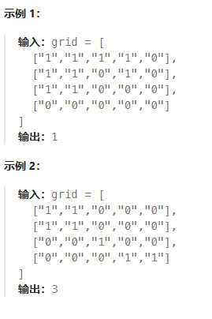
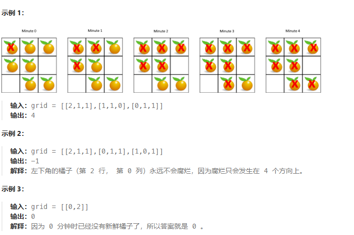
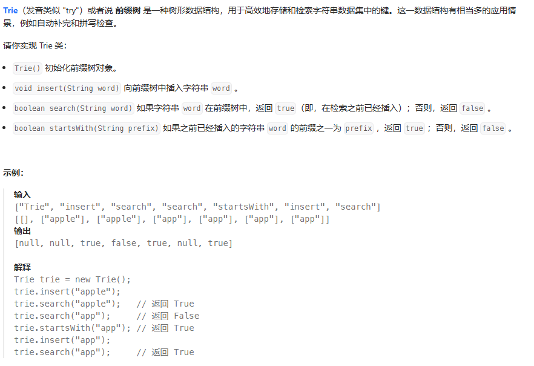

# 图论
## 200 岛屿数量
问题：
给你一个由 '1'（陆地）和 '0'（水）组成的的二维网格，请你计算网格中岛屿的数量。岛屿总是被水包围，并且每座岛屿只能由水平方向和/或竖直方向上相邻的陆地连接形成。此外，你可以假设该网格的四条边均被水包围。

深度优先搜索
class Solution {
private:
    void dfs(vector<vector<char>>& grid, int r, int c) {
        int nr = grid.size();
        int nc = grid[0].size();

        grid[r][c] = '0';
        if (r - 1 >= 0 && grid[r-1][c] == '1') dfs(grid, r - 1, c);
        if (r + 1 < nr && grid[r+1][c] == '1') dfs(grid, r + 1, c);
        if (c - 1 >= 0 && grid[r][c-1] == '1') dfs(grid, r, c - 1);
        if (c + 1 < nc && grid[r][c+1] == '1') dfs(grid, r, c + 1);
    }

public:
    int numIslands(vector<vector<char>>& grid) {
        int nr = grid.size();
        if (!nr) return 0;
        int nc = grid[0].size();

        int num_islands = 0;
        for (int r = 0; r < nr; ++r) {
            for (int c = 0; c < nc; ++c) {
                if (grid[r][c] == '1') {
                    ++num_islands;
                    dfs(grid, r, c);
                }
            }
        }

        return num_islands;
    }
};

广度优先搜索
class Solution {
public:
    int numIslands(vector<vector<char>>& grid) {
        int nr = grid.size();
        if (!nr) return 0;
        int nc = grid[0].size();

        int num_islands = 0;
        for (int r = 0; r < nr; ++r) {
            for (int c = 0; c < nc; ++c) {
                if (grid[r][c] == '1') {
                    ++num_islands;
                    grid[r][c] = '0';
                    queue<pair<int, int>> neighbors;
                    neighbors.push({r, c});
                    while (!neighbors.empty()) {
                        auto rc = neighbors.front();
                        neighbors.pop();
                        int row = rc.first, col = rc.second;
                        if (row - 1 >= 0 && grid[row-1][col] == '1') {
                            neighbors.push({row-1, col});
                            grid[row-1][col] = '0';
                        }
                        if (row + 1 < nr && grid[row+1][col] == '1') {
                            neighbors.push({row+1, col});
                            grid[row+1][col] = '0';
                        }
                        if (col - 1 >= 0 && grid[row][col-1] == '1') {
                            neighbors.push({row, col-1});
                            grid[row][col-1] = '0';
                        }
                        if (col + 1 < nc && grid[row][col+1] == '1') {
                            neighbors.push({row, col+1});
                            grid[row][col+1] = '0';
                        }
                    }
                }
            }
        }

        return num_islands;
    }
};

## 994 腐烂的橘子
问题：
在给定的 m x n 网格 grid 中，每个单元格可以有以下三个值之一：
值 0 代表空单元格；
值 1 代表新鲜橘子；
值 2 代表腐烂的橘子。
每分钟，腐烂的橘子 周围 4 个方向上相邻 的新鲜橘子都会腐烂。
返回 直到单元格中没有新鲜橘子为止所必须经过的最小分钟数。如果不可能，返回 -1 。

广度优先搜索
class Solution {
    int cnt;
    int dis[10][10];
    int dir_x[4] = {0, 1, 0, -1};
    int dir_y[4] = {1, 0, -1, 0};
public:
    int orangesRotting(vector<vector<int>>& grid) {
        queue<pair<int, int>>Q;
        memset(dis, -1, sizeof(dis));
        cnt = 0;
        int n = (int)grid.size(), m = (int)grid[0].size(), ans = 0;
        for (int i = 0; i < n; ++i) {
            for (int j = 0; j < m; ++j) {
                if (grid[i][j] == 2) {
                    Q.emplace(i, j);
                    dis[i][j] = 0;
                }
                else if (grid[i][j] == 1) {
                    cnt += 1;
                }
            }
        }
        while (!Q.empty()){
            auto [r, c] = Q.front();
            Q.pop();
            for (int i = 0; i < 4; ++i) {
                int tx = r + dir_x[i];
                int ty = c + dir_y[i];
                if (tx < 0|| tx >= n || ty < 0|| ty >= m || ~dis[tx][ty] || !grid[tx][ty]) {
                    continue;
                }
                dis[tx][ty] = dis[r][c] + 1;
                Q.emplace(tx, ty);
                if (grid[tx][ty] == 1) {
                    cnt -= 1;
                    ans = dis[tx][ty];
                    if (!cnt) {
                        break;
                    }
                }
            }
        }
        return cnt ? -1 : ans;
    }
};

class Solution {
public:
    int orangesRotting(vector<vector<int>>& grid) {
        int min = 0, fresh = 0;
        queue<pair<int, int>> q;
        for(int i = 0; i < grid.size(); i++) {
            for(int j = 0; j < grid[0].size(); j++)
                if(grid[i][j] == 1) fresh++;
                else if(grid[i][j] == 2) q.push({i, j});
        }
        vector<pair<int, int>> dirs = { {-1, 0}, {1, 0}, {0, -1}, {0, 1} };
        while(!q.empty()) {
            int n = q.size();
            bool rotten = false;
            for(int i = 0; i < n; i++) {
                auto x = q.front();
                q.pop();
                for(auto cur: dirs) {
                    int i = x.first + cur.first;
                    int j = x.second + cur.second;
                    if(i >= 0 && i < grid.size() && j >= 0 && j < grid[0].size() && grid[i][j] == 1) {
                        grid[i][j] = 2;
                        q.push({i, j});
                        fresh--;
                        rotten = true;
                    }
                }
            }
            if(rotten) min++;
        } 
        return fresh ? -1 : min;
    }
};

## 207 课程表
问题：
你这个学期必须选修 numCourses 门课程，记为 0 到 numCourses - 1 。
在选修某些课程之前需要一些先修课程。 先修课程按数组 prerequisites 给出，其中 prerequisites[i] = [ai, bi] ，表示如果要学习课程 ai 则 必须 先学习课程  bi 。
例如，先修课程对 [0, 1] 表示：想要学习课程 0 ，你需要先完成课程 1 。
请你判断是否可能完成所有课程的学习？如果可以，返回 true ；否则，返回 false 。

输入：numCourses = 2, prerequisites = [[1,0]]
输出：true
解释：总共有 2 门课程。学习课程 1 之前，你需要完成课程 0 。这是可能的。

深度优先搜索
class Solution {
private:
    vector<vector<int>> edges;
    vector<int> visited;
    bool valid = true;

public:
    void dfs(int u) {
        visited[u] = 1;
        for (int v: edges[u]) {
            if (visited[v] == 0) {
                dfs(v);
                if (!valid) {
                    return;
                }
            }
            else if (visited[v] == 1) {
                valid = false;
                return;
            }
        }
        visited[u] = 2;
    }

    bool canFinish(int numCourses, vector<vector<int>>& prerequisites) {
        edges.resize(numCourses);
        visited.resize(numCourses);
        for (const auto& info: prerequisites) {
            edges[info[1]].push_back(info[0]);
        }
        for (int i = 0; i < numCourses && valid; ++i) {
            if (!visited[i]) {
                dfs(i);
            }
        }
        return valid;
    }
};

广度优先搜索
class Solution {
private:
    vector<vector<int>> edges;
    vector<int> indeg;

public:
    bool canFinish(int numCourses, vector<vector<int>>& prerequisites) {
        edges.resize(numCourses);
        indeg.resize(numCourses);
        for (const auto& info: prerequisites) {
            edges[info[1]].push_back(info[0]);
            ++indeg[info[0]];
        }

        queue<int> q;
        for (int i = 0; i < numCourses; ++i) {
            if (indeg[i] == 0) {
                q.push(i);
            }
        }

        int visited = 0;
        while (!q.empty()) {
            ++visited;
            int u = q.front();
            q.pop();
            for (int v: edges[u]) {
                --indeg[v];
                if (indeg[v] == 0) {
                    q.push(v);
                }
            }
        }

        return visited == numCourses;
    }
};

## 208 实现前缀树

字典树
class Trie {
private:
    vector<Trie*> children;
    bool isEnd;

    Trie* searchPrefix(string prefix) {
        Trie* node = this;
        for (char ch : prefix) {
            ch -= 'a';
            if (node->children[ch] == nullptr) {
                return nullptr;
            }
            node = node->children[ch];
        }
        return node;
    }

public:
    Trie() : children(26), isEnd(false) {}

    void insert(string word) {
        Trie* node = this;
        for (char ch : word) {
            ch -= 'a';
            if (node->children[ch] == nullptr) {
                node->children[ch] = new Trie();
            }
            node = node->children[ch];
        }
        node->isEnd = true;
    }

    bool search(string word) {
        Trie* node = this->searchPrefix(word);
        return node != nullptr && node->isEnd;
    }

    bool startsWith(string prefix) {
        return this->searchPrefix(prefix) != nullptr;
    }
};

