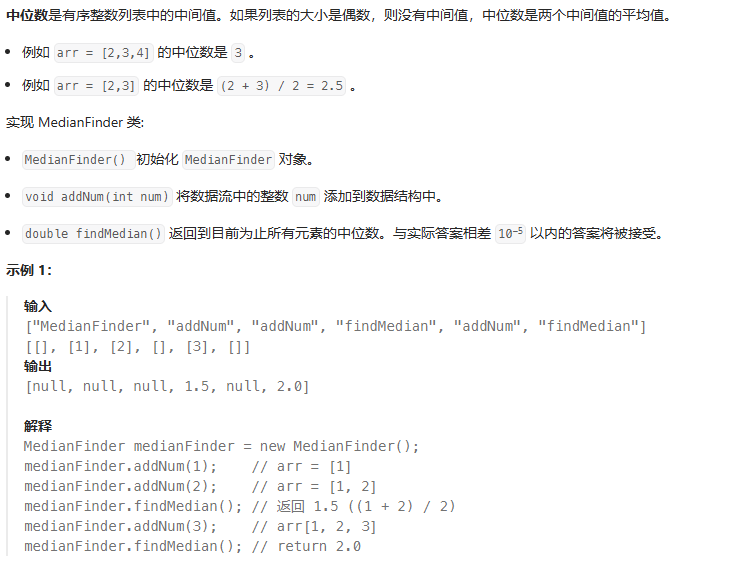

# 堆
## 215 数组中第K个最大的元素
问题：
给定整数数组 nums 和整数 k，请返回数组中第 k 个最大的元素。
请注意，你需要找的是数组排序后的第 k 个最大的元素，而不是第 k 个不同的元素。
你必须设计并实现时间复杂度为 O(n) 的算法解决此问题。

示例 1:

输入: [3,2,1,5,6,4], k = 2
输出: 5
示例 2:

输入: [3,2,3,1,2,4,5,5,6], k = 4
输出: 4

基于快速排序的选择方法
class Solution {
public:
    int quickselect(vector<int> &nums, int l, int r, int k) {
        if (l == r)
            return nums[k];
        int partition = nums[l], i = l - 1, j = r + 1;
        while (i < j) {
            do i++; while (nums[i] < partition);
            do j--; while (nums[j] > partition);
            if (i < j)
                swap(nums[i], nums[j]);
        }
        if (k <= j)return quickselect(nums, l, j, k);
        else return quickselect(nums, j + 1, r, k);
    }

    int findKthLargest(vector<int> &nums, int k) {
        int n = nums.size();
        return quickselect(nums, 0, n - 1, n - k);
    }
};

基于堆排序的选择方法
class Solution {
public:
    void maxHeapify(vector<int>& a, int i, int heapSize) {
        int l = i * 2 + 1, r = i * 2 + 2, largest = i;
        if (l < heapSize && a[l] > a[largest]) {
            largest = l;
        } 
        if (r < heapSize && a[r] > a[largest]) {
            largest = r;
        }
        if (largest != i) {
            swap(a[i], a[largest]);
            maxHeapify(a, largest, heapSize);
        }
    }

    void buildMaxHeap(vector<int>& a, int heapSize) {
        for (int i = heapSize / 2; i >= 0; --i) {
            maxHeapify(a, i, heapSize);
        } 
    }

    int findKthLargest(vector<int>& nums, int k) {
        int heapSize = nums.size();
        buildMaxHeap(nums, heapSize);
        for (int i = nums.size() - 1; i >= nums.size() - k + 1; --i) {
            swap(nums[0], nums[i]);
            --heapSize;
            maxHeapify(nums, 0, heapSize);
        }
        return nums[0];
    }
};

## 295 数据流的中位数

优先队列
class MedianFinder {
public:
    priority_queue<int, vector<int>, less<int>> queMin;
    priority_queue<int, vector<int>, greater<int>> queMax;

    MedianFinder() {}

    void addNum(int num) {
        if (queMin.empty() || num <= queMin.top()) {
            queMin.push(num);
            if (queMax.size() + 1 < queMin.size()) {
                queMax.push(queMin.top());
                queMin.pop();
            }
        } else {
            queMax.push(num);
            if (queMax.size() > queMin.size()) {
                queMin.push(queMax.top());
                queMax.pop();
            }
        }
    }

    double findMedian() {
        if (queMin.size() > queMax.size()) {
            return queMin.top();
        }
        return (queMin.top() + queMax.top()) / 2.0;
    }
};

有序集合+双指针
class MedianFinder {
    multiset<int> nums;
    multiset<int>::iterator left, right;

public:
    MedianFinder() : left(nums.end()), right(nums.end()) {}

    void addNum(int num) {
        const size_t n = nums.size();

        nums.insert(num);
        if (!n) {
            left = right = nums.begin();
        } else if (n & 1) {
            if (num < *left) {
                left--;
            } else {
                right++;
            }
        } else {
            if (num > *left && num < *right) {
                left++;
                right--;
            } else if (num >= *right) {
                left++;
            } else {
                right--;
                left = right;
            }
        }
    }

    double findMedian() {
        return (*left + *right) / 2.0;
    }
};

