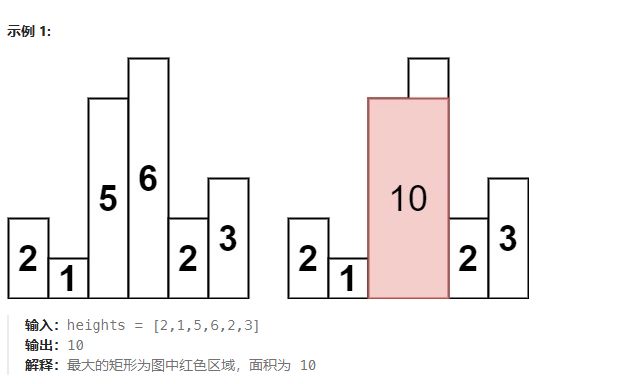

# 栈
## 20 有效的括号
给定一个只包括 '('，')'，'{'，'}'，'['，']' 的字符串 s ，判断字符串是否有效。
有效字符串需满足：
左括号必须用相同类型的右括号闭合。
左括号必须以正确的顺序闭合。
每个右括号都有一个对应的相同类型的左括号。

示例 1：

输入：s = "()"
输出：true
示例 2：

输入：s = "()[]{}"
输出：true
示例 3：

输入：s = "(]"
输出：false

栈
class Solution {
public:
    bool isValid(string s) {
        int n = s.size();
        if (n % 2 == 1) {
            return false;
        }

        unordered_map<char, char> pairs = {
            {')', '('},
            {']', '['},
            {'}', '{'}
        };
        stack<char> stk;
        for (char ch: s) {
            if (pairs.count(ch)) {
                if (stk.empty() || stk.top() != pairs[ch]) {
                    return false;
                }
                stk.pop();
            }
            else {
                stk.push(ch);
            }
        }
        return stk.empty();
    }
};

class Solution {
public:
    bool isValid(string s) {
        unordered_map<char,int> m{{'(',1},{'[',2},{'{',3},
                                {')',4},{']',5},{'}',6}};
        stack<char> st;
        bool istrue=true;
        for(char c:s){
            int flag=m[c];
            if(flag>=1&&flag<=3) st.push(c);
            else if(!st.empty()&&m[st.top()]==flag-3) st.pop();
            else {istrue=false;break;}
        }
        if(!st.empty()) istrue=false;
        return istrue;
    }
};

## 155 最小栈
问题：
设计一个支持 push ，pop ，top 操作，并能在常数时间内检索到最小元素的栈。
实现 MinStack 类:
MinStack() 初始化堆栈对象。
void push(int val) 将元素val推入堆栈。
void pop() 删除堆栈顶部的元素。
int top() 获取堆栈顶部的元素。
int getMin() 获取堆栈中的最小元素。
示例 1:

输入：
["MinStack","push","push","push","getMin","pop","top","getMin"]
[[],[-2],[0],[-3],[],[],[],[]]

输出：
[null,null,null,null,-3,null,0,-2]

解释：
MinStack minStack = new MinStack();
minStack.push(-2);
minStack.push(0);
minStack.push(-3);
minStack.getMin();   --> 返回 -3.
minStack.pop();
minStack.top();      --> 返回 0.
minStack.getMin();   --> 返回 -2.

辅助栈
class MinStack {
    stack<int> x_stack;
    stack<int> min_stack;
public:
    MinStack() {
        min_stack.push(INT_MAX);
    }
    
    void push(int x) {
        x_stack.push(x);
        min_stack.push(min(min_stack.top(), x));
    }
    
    void pop() {
        x_stack.pop();
        min_stack.pop();
    }
    
    int top() {
        return x_stack.top();
    }
    
    int getMin() {
        return min_stack.top();
    }
};

## 394 字符串解码
问题：
给定一个经过编码的字符串，返回它解码后的字符串。
编码规则为: k[encoded_string]，表示其中方括号内部的 encoded_string 正好重复 k 次。注意 k 保证为正整数。
你可以认为输入字符串总是有效的；输入字符串中没有额外的空格，且输入的方括号总是符合格式要求的。
此外，你可以认为原始数据不包含数字，所有的数字只表示重复的次数 k ，例如不会出现像 3a 或 2[4] 的输入。
示例 1：
输入：s = "3[a]2[bc]"
输出："aaabcbc"
示例 2：

输入：s = "3[a2[c]]"
输出："accaccacc"
示例 3：

输入：s = "2[abc]3[cd]ef"
输出："abcabccdcdcdef"
示例 4：

输入：s = "abc3[cd]xyz"
输出："abccdcdcdxyz"

栈操作
class Solution {
public:
    string getDigits(string &s, size_t &ptr) {
        string ret = "";
        while (isdigit(s[ptr])) {
            ret.push_back(s[ptr++]);
        }
        return ret;
    }

    string getString(vector <string> &v) {
        string ret;
        for (const auto &s: v) {
            ret += s;
        }
        return ret;
    }

    string decodeString(string s) {
        vector <string> stk;
        size_t ptr = 0;

        while (ptr < s.size()) {
            char cur = s[ptr];
            if (isdigit(cur)) {
                // 获取一个数字并进栈
                string digits = getDigits(s, ptr);
                stk.push_back(digits);
            } else if (isalpha(cur) || cur == '[') {
                // 获取一个字母并进栈
                stk.push_back(string(1, s[ptr++])); 
            } else {
                ++ptr;
                vector <string> sub;
                while (stk.back() != "[") {
                    sub.push_back(stk.back());
                    stk.pop_back();
                }
                reverse(sub.begin(), sub.end());
                // 左括号出栈
                stk.pop_back();
                // 此时栈顶为当前 sub 对应的字符串应该出现的次数
                int repTime = stoi(stk.back()); 
                stk.pop_back();
                string t, o = getString(sub);
                // 构造字符串
                while (repTime--) t += o; 
                // 将构造好的字符串入栈
                stk.push_back(t);
            }
        }

        return getString(stk);
    }
};

## 739 每日温度
问题：
给定一个整数数组 temperatures ，表示每天的温度，返回一个数组 answer ，其中 answer[i] 是指对于第 i 天，下一个更高温度出现在几天后。如果气温在这之后都不会升高，请在该位置用 0 来代替。

示例 1:

输入: temperatures = [73,74,75,71,69,72,76,73]
输出: [1,1,4,2,1,1,0,0]
示例 2:

输入: temperatures = [30,40,50,60]
输出: [1,1,1,0]
示例 3:

输入: temperatures = [30,60,90]
输出: [1,1,0]

暴力
class Solution {
public:
    vector<int> dailyTemperatures(vector<int>& temperatures) {
        int n = temperatures.size();
        vector<int> ans(n), next(101, INT_MAX);
        for (int i = n - 1; i >= 0; --i) {
            int warmerIndex = INT_MAX;
            for (int t = temperatures[i] + 1; t <= 100; ++t) {
                warmerIndex = min(warmerIndex, next[t]);
            }
            if (warmerIndex != INT_MAX) {
                ans[i] = warmerIndex - i;
            }
            next[temperatures[i]] = i;
        }
        return ans;
    }
};

单调栈
class Solution {
public:
    vector<int> dailyTemperatures(vector<int>& temperatures) {
        int n = temperatures.size();
        vector<int> ans(n);
        stack<int> s;
        for (int i = 0; i < n; ++i) {
            while (!s.empty() && temperatures[i] > temperatures[s.top()]) {
                int previousIndex = s.top();
                ans[previousIndex] = i - previousIndex;
                s.pop();
            }
            s.push(i);
        }
        return ans;
    }
};

## 84 柱状图的最大矩形
问题：
给定 n 个非负整数，用来表示柱状图中各个柱子的高度。每个柱子彼此相邻，且宽度为 1 。
求在该柱状图中，能够勾勒出来的矩形的最大面积。

class Solution {
public:
    int largestRectangleArea(vector<int>& heights) {
        int n = heights.size();
        int ans = 0;
        // 枚举左边界
        for (int left = 0; left < n; ++left) {
            int minHeight = INT_MAX;
            // 枚举右边界
            for (int right = left; right < n; ++right) {
                // 确定高度
                minHeight = min(minHeight, heights[right]);
                // 计算面积
                ans = max(ans, (right - left + 1) * minHeight);
            }
        }
        return ans;
    }
};

class Solution {
public:
    int largestRectangleArea(vector<int>& heights) {
        int n = heights.size();
        int ans = 0;
        for (int mid = 0; mid < n; ++mid) {
            // 枚举高
            int height = heights[mid];
            int left = mid, right = mid;
            // 确定左右边界
            while (left - 1 >= 0 && heights[left - 1] >= height) {
                --left;
            }
            while (right + 1 < n && heights[right + 1] >= height) {
                ++right;
            }
            // 计算面积
            ans = max(ans, (right - left + 1) * height);
        }
        return ans;
    }
};

单调栈
class Solution {
public:
    int largestRectangleArea(vector<int>& heights) {
        int n = heights.size();
        vector<int> left(n), right(n);
        
        stack<int> mono_stack;
        for (int i = 0; i < n; ++i) {
            while (!mono_stack.empty() && heights[mono_stack.top()] >= heights[i]) {
                mono_stack.pop();
            }
            left[i] = (mono_stack.empty() ? -1 : mono_stack.top());
            mono_stack.push(i);
        }

        mono_stack = stack<int>();
        for (int i = n - 1; i >= 0; --i) {
            while (!mono_stack.empty() && heights[mono_stack.top()] >= heights[i]) {
                mono_stack.pop();
            }
            right[i] = (mono_stack.empty() ? n : mono_stack.top());
            mono_stack.push(i);
        }
        
        int ans = 0;
        for (int i = 0; i < n; ++i) {
            ans = max(ans, (right[i] - left[i] - 1) * heights[i]);
        }
        return ans;
    }
};

