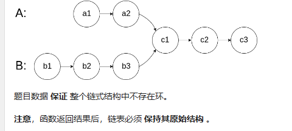

# 链表

## 160 相交链表
给你两个单链表的头节点 headA 和 headB ，请你找出并返回两个单链表相交的起始节点。如果两个链表不存在相交节点，返回 null 。
图示两个链表在节点 c1 开始相交：

哈希集合
class Solution {
public:
    ListNode *getIntersectionNode(ListNode *headA, ListNode *headB) {
        unordered_set<ListNode *> visited;
        ListNode *temp = headA;
        while (temp != nullptr) {
            visited.insert(temp);
            temp = temp->next;
        }
        temp = headB;
        while (temp != nullptr) {
            if (visited.count(temp)) {
                return temp;
            }
            temp = temp->next;
        }
        return nullptr;
    }
};

双指针法
class Solution {
public:
    ListNode *getIntersectionNode(ListNode *headA, ListNode *headB) {
        if (headA == nullptr || headB == nullptr) {
            return nullptr;
        }
        ListNode *pA = headA, *pB = headB;
        while (pA != pB) {
            pA = pA == nullptr ? headB : pA->next;
            pB = pB == nullptr ? headA : pB->next;
        }
        return pA;
    }
};

class Solution {
public:
    ListNode *getIntersectionNode(ListNode *headA, ListNode *headB) {
        ListNode *A = headA, *B = headB;
        while (A != B) {
            A = A != nullptr ? A->next : headB;
            B = B != nullptr ? B->next : headA;
        }
        return A;
    }
};

## 206 反转链表
问题：给你单链表的头节点 head ，请你反转链表，并返回反转后的链表。

输入：head = [1,2,3,4,5]
输出：[5,4,3,2,1]

迭代
class Solution {
public:
    ListNode* reverseList(ListNode* head) {
        ListNode* prev = nullptr;
        ListNode* curr = head;
        while (curr) {
            ListNode* next = curr->next;
            curr->next = prev;
            prev = curr;
            curr = next;
        }
        return prev;
    }
};

递归
class Solution {
public:
    ListNode* reverseList(ListNode* head) {
        if (!head || !head->next) {
            return head;
        }
        ListNode* newHead = reverseList(head->next);
        head->next->next = head;
        head->next = nullptr;
        return newHead;
    }
};

## 234 回文链表
给你一个单链表的头节点 head ，请你判断该链表是否为回文链表。如果是，返回 true ；否则，返回 false 。

值复制到数组中后用双指针法
class Solution {
public:
    bool isPalindrome(ListNode* head) {
        vector<int> vals;
        while (head != nullptr) {
            vals.emplace_back(head->val);
            head = head->next;
        }
        for (int i = 0, j = (int)vals.size() - 1; i < j; ++i, --j) {
            if (vals[i] != vals[j]) {
                return false;
            }
        }
        return true;
    }
};

递归
class Solution {
    ListNode* frontPointer;
public:
    bool recursivelyCheck(ListNode* currentNode) {
        if (currentNode != nullptr) {
            if (!recursivelyCheck(currentNode->next)) {
                return false;
            }
            if (currentNode->val != frontPointer->val) {
                return false;
            }
            frontPointer = frontPointer->next;
        }
        return true;
    }

    bool isPalindrome(ListNode* head) {
        frontPointer = head;
        return recursivelyCheck(head);
    }
};

## 141 环形链表
问题：
给你一个链表的头节点 head ，判断链表中是否有环。如果链表中有某个节点，可以通过连续跟踪 next 指针再次到达，则链表中存在环。 为了表示给定链表中的环，评测系统内部使用整数 pos 来表示链表尾连接到链表中的位置（索引从 0 开始）。注意：pos 不作为参数进行传递 。仅仅是为了标识链表的实际情况。
如果链表中存在环 ，则返回 true 。 否则，返回 false 

哈希表法
class Solution {
public:
    bool hasCycle(ListNode *head) {
        unordered_set<ListNode*> seen;
        while (head != nullptr) {
            if (seen.count(head)) {
                return true;
            }
            seen.insert(head);
            head = head->next;
        }
        return false;
    }
};

快慢指针法
class Solution {
public:
    bool hasCycle(ListNode* head) {
        if (head == nullptr || head->next == nullptr) {
            return false;
        }
        ListNode* slow = head;
        ListNode* fast = head->next;
        while (slow != fast) {
            if (fast == nullptr || fast->next == nullptr) {
                return false;
            }
            slow = slow->next;
            fast = fast->next->next;
        }
        return true;
    }
};

## 142 环形链表2
给定一个链表的头节点  head ，返回链表开始入环的第一个节点。 如果链表无环，则返回 null。
如果链表中有某个节点，可以通过连续跟踪 next 指针再次到达，则链表中存在环。 为了表示给定链表中的环，评测系统内部使用整数 pos 来表示链表尾连接到链表中的位置（索引从 0 开始）。如果 pos 是 -1，则在该链表中没有环。注意：pos 不作为参数进行传递，仅仅是为了标识链表的实际情况。
不允许修改 链表。

哈希表
class Solution {
public:
    ListNode *detectCycle(ListNode *head) {
        unordered_set<ListNode *> visited;
        while (head != nullptr) {
            if (visited.count(head)) {
                return head;
            }
            visited.insert(head);
            head = head->next;
        }
        return nullptr;
    }
};

快慢指针
class Solution {
public:
    ListNode *detectCycle(ListNode *head) {
        ListNode *slow = head, *fast = head;
        while (fast != nullptr) {
            slow = slow->next;
            if (fast->next == nullptr) {
                return nullptr;
            }
            fast = fast->next->next;
            if (fast == slow) {
                ListNode *ptr = head;
                while (ptr != slow) {
                    ptr = ptr->next;
                    slow = slow->next;
                }
                return ptr;
            }
        }
        return nullptr;
    }
};

双指针法
class Solution {
public:
    ListNode *detectCycle(ListNode *head) {
        ListNode* fast = head;
        ListNode* slow = head;
        while (true) {
            if (fast == nullptr || fast->next == nullptr) return nullptr;
            fast = fast->next->next;
            slow = slow->next;
            if (fast == slow) break;
        }
        fast = head;
        while (slow != fast) {
            slow = slow->next;
            fast = fast->next;
        }
        return fast;
    }
};

## 21 合并两个有序链表
问题：
将两个升序链表合并为一个新的 升序 链表并返回。新链表是通过拼接给定的两个链表的所有节点组成的。 

递归
class Solution {
public:
    ListNode* mergeTwoLists(ListNode* l1, ListNode* l2) {
        if (l1 == nullptr) {
            return l2;
        } else if (l2 == nullptr) {
            return l1;
        } else if (l1->val < l2->val) {
            l1->next = mergeTwoLists(l1->next, l2);
            return l1;
        } else {
            l2->next = mergeTwoLists(l1, l2->next);
            return l2;
        }
    }
};

迭代
class Solution {
public:
    ListNode* mergeTwoLists(ListNode* l1, ListNode* l2) {
        ListNode* preHead = new ListNode(-1);

        ListNode* prev = preHead;
        while (l1 != nullptr && l2 != nullptr) {
            if (l1->val < l2->val) {
                prev->next = l1;
                l1 = l1->next;
            } else {
                prev->next = l2;
                l2 = l2->next;
            }
            prev = prev->next;
        }

        // 合并后 l1 和 l2 最多只有一个还未被合并完，我们直接将链表末尾指向未合并完的链表即可
        prev->next = l1 == nullptr ? l2 : l1;

        return preHead->next;
    }
};

## 2 两数相加
问题：
给你两个 非空 的链表，表示两个非负的整数。它们每位数字都是按照 逆序 的方式存储的，并且每个节点只能存储 一位 数字。
请你将两个数相加，并以相同形式返回一个表示和的链表。你可以假设除了数字 0 之外，这两个数都不会以 0 开头。

模拟
class Solution {
public:
    ListNode* addTwoNumbers(ListNode* l1, ListNode* l2) {
        ListNode *head = nullptr, *tail = nullptr;
        int carry = 0;
        while (l1 || l2) {
            int n1 = l1 ? l1->val: 0;
            int n2 = l2 ? l2->val: 0;
            int sum = n1 + n2 + carry;
            if (!head) {
                head = tail = new ListNode(sum % 10);
            } else {
                tail->next = new ListNode(sum % 10);
                tail = tail->next;
            }
            carry = sum / 10;
            if (l1) {
                l1 = l1->next;
            }
            if (l2) {
                l2 = l2->next;
            }
        }
        if (carry > 0) {
            tail->next = new ListNode(carry);
        }
        return head;
    }
};

## 19 删除链表的倒数第N个结点
问题：
给你一个链表，删除链表的倒数第 n 个结点，并且返回链表的头结点。

计算链表长度
class Solution {
public:
    int getLength(ListNode* head) {
        int length = 0;
        while (head) {
            ++length;
            head = head->next;
        }
        return length;
    }

    ListNode* removeNthFromEnd(ListNode* head, int n) {
        ListNode* dummy = new ListNode(0, head);
        int length = getLength(head);
        ListNode* cur = dummy;
        for (int i = 1; i < length - n + 1; ++i) {
            cur = cur->next;
        }
        cur->next = cur->next->next;
        ListNode* ans = dummy->next;
        delete dummy;
        return ans;
    }
};

栈
class Solution {
public:
    ListNode* removeNthFromEnd(ListNode* head, int n) {
        ListNode* dummy = new ListNode(0, head);
        stack<ListNode*> stk;
        ListNode* cur = dummy;
        while (cur) {
            stk.push(cur);
            cur = cur->next;
        }
        for (int i = 0; i < n; ++i) {
            stk.pop();
        }
        ListNode* prev = stk.top();
        prev->next = prev->next->next;
        ListNode* ans = dummy->next;
        delete dummy;
        return ans;
    }
};

双指针法
class Solution {
public:
    ListNode* removeNthFromEnd(ListNode* head, int n) {
        ListNode* dummy = new ListNode(0, head);
        ListNode* first = head;
        ListNode* second = dummy;
        for (int i = 0; i < n; ++i) {
            first = first->next;
        }
        while (first) {
            first = first->next;
            second = second->next;
        }
        second->next = second->next->next;
        ListNode* ans = dummy->next;
        delete dummy;
        return ans;
    }
};

## 24 两两交换链表中的结点
问题：
给你一个链表，两两交换其中相邻的节点，并返回交换后链表的头节点。你必须在不修改节点内部的值的情况下完成本题（即，只能进行节点交换）。

递归
class Solution {
public:
    ListNode* swapPairs(ListNode* head) {
        if (head == nullptr || head->next == nullptr) {
            return head;
        }
        ListNode* newHead = head->next;
        head->next = swapPairs(newHead->next);
        newHead->next = head;
        return newHead;
    }
};

迭代
class Solution {
public:
    ListNode* swapPairs(ListNode* head) {
        ListNode* dummyHead = new ListNode(0);
        dummyHead->next = head;
        ListNode* temp = dummyHead;
        while (temp->next != nullptr && temp->next->next != nullptr) {
            ListNode* node1 = temp->next;
            ListNode* node2 = temp->next->next;
            temp->next = node2;
            node1->next = node2->next;
            node2->next = node1;
            temp = node1;
        }
        ListNode* ans = dummyHead->next;
        delete dummyHead;
        return ans;
    }
};

## 25 K个一组翻转链表
问题：
给你链表的头节点 head ，每 k 个节点一组进行翻转，请你返回修改后的链表。
k 是一个正整数，它的值小于或等于链表的长度。如果节点总数不是 k 的整数倍，那么请将最后剩余的节点保持原有顺序。
你不能只是单纯的改变节点内部的值，而是需要实际进行节点交换。

模拟
class Solution {
public:
    // 翻转一个子链表，并且返回新的头与尾
    pair<ListNode*, ListNode*> myReverse(ListNode* head, ListNode* tail) {
        ListNode* prev = tail->next;
        ListNode* p = head;
        while (prev != tail) {
            ListNode* nex = p->next;
            p->next = prev;
            prev = p;
            p = nex;
        }
        return {tail, head};
    }

    ListNode* reverseKGroup(ListNode* head, int k) {
        ListNode* hair = new ListNode(0);
        hair->next = head;
        ListNode* pre = hair;

        while (head) {
            ListNode* tail = pre;
            // 查看剩余部分长度是否大于等于 k
            for (int i = 0; i < k; ++i) {
                tail = tail->next;
                if (!tail) {
                    return hair->next;
                }
            }
            ListNode* nex = tail->next;
            // 这里是 C++17 的写法，也可以写成
            // pair<ListNode*, ListNode*> result = myReverse(head, tail);
            // head = result.first;
            // tail = result.second;
            tie(head, tail) = myReverse(head, tail);
            // 把子链表重新接回原链表
            pre->next = head;
            tail->next = nex;
            pre = tail;
            head = tail->next;
        }

        return hair->next;
    }
};

递归
class Solution {
public:
    ListNode* reverseKGroup(ListNode* head, int k) {
        ListNode *p = head;
        for(int i = 0; i < k; i++) {
            if(!p) return head;
            p = p->next;
        }

        ListNode *q = head;
        ListNode *pre = nullptr;
        while(q != p) {
            ListNode *tmp = q->next;
            q->next = pre;
            pre = q;
            q = tmp;
        }

        head->next = reverseKGroup(p, k);
        return pre;
    }
};

## 138 随机链表的复制

回溯+哈希表
class Solution {
public:
    unordered_map<Node*, Node*> cachedNode;

    Node* copyRandomList(Node* head) {
        if (head == nullptr) {
            return nullptr;
        }
        if (!cachedNode.count(head)) {
            Node* headNew = new Node(head->val);
            cachedNode[head] = headNew;
            headNew->next = copyRandomList(head->next);
            headNew->random = copyRandomList(head->random);
        }
        return cachedNode[head];
    }
};

迭代+节点拆分
class Solution {
public:
    Node* copyRandomList(Node* head) {
        if (head == nullptr) {
            return nullptr;
        }
        for (Node* node = head; node != nullptr; node = node->next->next) {
            Node* nodeNew = new Node(node->val);
            nodeNew->next = node->next;
            node->next = nodeNew;
        }
        for (Node* node = head; node != nullptr; node = node->next->next) {
            Node* nodeNew = node->next;
            nodeNew->random = (node->random != nullptr) ? node->random->next : nullptr;
        }
        Node* headNew = head->next;
        for (Node* node = head; node != nullptr; node = node->next) {
            Node* nodeNew = node->next;
            node->next = node->next->next;
            nodeNew->next = (nodeNew->next != nullptr) ? nodeNew->next->next : nullptr;
        }
        return headNew;
    }
};

## 148 排序链表

自顶向下的归并排序
class Solution {
public:
    ListNode* sortList(ListNode* head) {
        return sortList(head, nullptr);
    }

    ListNode* sortList(ListNode* head, ListNode* tail) {
        if (head == nullptr) {
            return head;
        }
        if (head->next == tail) {
            head->next = nullptr;
            return head;
        }
        ListNode* slow = head, *fast = head;
        while (fast != tail) {
            slow = slow->next;
            fast = fast->next;
            if (fast != tail) {
                fast = fast->next;
            }
        }
        ListNode* mid = slow;
        return merge(sortList(head, mid), sortList(mid, tail));
    }

    ListNode* merge(ListNode* head1, ListNode* head2) {
        ListNode* dummyHead = new ListNode(0);
        ListNode* temp = dummyHead, *temp1 = head1, *temp2 = head2;
        while (temp1 != nullptr && temp2 != nullptr) {
            if (temp1->val <= temp2->val) {
                temp->next = temp1;
                temp1 = temp1->next;
            } else {
                temp->next = temp2;
                temp2 = temp2->next;
            }
            temp = temp->next;
        }
        if (temp1 != nullptr) {
            temp->next = temp1;
        } else if (temp2 != nullptr) {
            temp->next = temp2;
        }
        return dummyHead->next;
    }
};

自底向上归并排序
class Solution {
public:
    ListNode* sortList(ListNode* head) {
        if (head == nullptr) {
            return head;
        }
        int length = 0;
        ListNode* node = head;
        while (node != nullptr) {
            length++;
            node = node->next;
        }
        ListNode* dummyHead = new ListNode(0, head);
        for (int subLength = 1; subLength < length; subLength <<= 1) {
            ListNode* prev = dummyHead, *curr = dummyHead->next;
            while (curr != nullptr) {
                ListNode* head1 = curr;
                for (int i = 1; i < subLength && curr->next != nullptr; i++) {
                    curr = curr->next;
                }
                ListNode* head2 = curr->next;
                curr->next = nullptr;
                curr = head2;
                for (int i = 1; i < subLength && curr != nullptr && curr->next != nullptr; i++) {
                    curr = curr->next;
                }
                ListNode* next = nullptr;
                if (curr != nullptr) {
                    next = curr->next;
                    curr->next = nullptr;
                }
                ListNode* merged = merge(head1, head2);
                prev->next = merged;
                while (prev->next != nullptr) {
                    prev = prev->next;
                }
                curr = next;
            }
        }
        return dummyHead->next;
    }

    ListNode* merge(ListNode* head1, ListNode* head2) {
        ListNode* dummyHead = new ListNode(0);
        ListNode* temp = dummyHead, *temp1 = head1, *temp2 = head2;
        while (temp1 != nullptr && temp2 != nullptr) {
            if (temp1->val <= temp2->val) {
                temp->next = temp1;
                temp1 = temp1->next;
            } else {
                temp->next = temp2;
                temp2 = temp2->next;
            }
            temp = temp->next;
        }
        if (temp1 != nullptr) {
            temp->next = temp1;
        } else if (temp2 != nullptr) {
            temp->next = temp2;
        }
        return dummyHead->next;
    }
};

冒泡排序
// 交换节点, 不交换值
class Solution {
public:
    ListNode* sortList(ListNode* head) {
        if (!head) return nullptr;

        ListNode* dummyNode = new ListNode(-1);
        dummyNode->next = head;

        int n = 0; // 统计链表长度
        ListNode* p = head;
        while (p) {
            n++;
            p = p->next;
        }

        while (n--) { // 外层循环n次
            // 初始化pre和p          
            ListNode* pre = dummyNode;
            ListNode* p = dummyNode->next;
            bool finished = true;
            while (p && p->next) { // 内层循环
                ListNode* node1 = p;
                ListNode* node2 = p->next;
                
                bool swap_flag = false; // 标记是否交换
                if (node1->val > node2->val) {
                    swap_flag = true;
                    finished = false;
                    pre->next = node2;
                    ListNode* tmp = node2->next; // 记录下一个节点，防止丢失
                    node2->next = node1;
                    node1->next = tmp; 
                }
                pre = (swap_flag) ? node2 : node1;
                p = (swap_flag) ? node1 : node2;
            }
            if (finished) break;
        }
        return dummyNode->next;
    }
};

// 交换值, 不交换节点
class Solution {
public:
    ListNode* sortList(ListNode* head) {
        if (!head) return nullptr;

        ListNode* dummyNode = new ListNode(-1);
        dummyNode->next = head;

        int n = 0; // 统计链表长度
        ListNode* p = head;
        while (p) {
            n++;
            p = p->next;
        }

        while (n--) { // 外层循环n次
            ListNode* pre = dummyNode;
            ListNode* p = dummyNode->next;
            while (p && p->next) { // 内层循环
                if (p->val > p->next->val) {
                    swap(p->val, p->next->val); // 交换值
                }
                pre = p;
                p = p->next;
            }
        }
        return dummyNode->next;
    }
};

选择
// 26 / 30 个通过的测试用例
class Solution {
public:
    ListNode* sortList(ListNode* head) {
        if (!head) return nullptr;

        ListNode* dummyNode = new ListNode(-1);
        dummyNode->next = head;

        int n = 0; // 统计链表长度
        ListNode* p = head;
        while (p) {
            n++;
            p = p->next;
        }

        p = head;
        while (p) { // 外层循环n次
            int min = p->val;
            ListNode* min_q = p;
            ListNode* q = p;
            while (q) { // 对于选择排序: 内层循环, 从外层循环的索引开始
                if (q->val < min) {
                    min = q->val;
                    min_q = q;
                }
                q = q->next;
            }
            swap(min_q->val, p->val); // 交换值
            p = p->next;
        }
        return dummyNode->next;
    }
};

插入
class Solution {
public:
    ListNode* insertionSortList(ListNode* head) {
        ListNode* headnode = new ListNode(INT_MIN);
        ListNode* p = head;
        while (p) {
            auto tmp = p->next;
            ListNode* q = headnode;
            while (q->next && q->next->val < p->val) {
                q = q->next;
            }
            p->next = q->next;
            q->next = p;
            p = tmp;
        }
        return headnode->next;
    }
};

归并
class Solution {
public:
    ListNode* sortList(ListNode* head) {
        if (!head || !head->next) return head;
        ListNode* mid = findMid(head);
        ListNode* newHead = mid->next;
        mid->next = nullptr;

        ListNode* left = sortList(head);
        ListNode* right = sortList(newHead);
        return merge(left, right);
    }

    ListNode* findMid(ListNode* head) {
        ListNode* slow = head;
        ListNode* fast = head;
        while (fast->next && fast->next->next) {
            slow = slow->next;
            fast = fast->next->next;
        }
        return slow;
    }

    ListNode* merge(ListNode* l1, ListNode* l2) {
        if (!l1) return l2;
        if (!l2) return l1;
        if (l1->val <= l2->val) {
            l1->next = merge(l1->next, l2);
            return l1;
        } else {
            l2->next = merge(l1, l2->next);
            return l2;
        }
    }
};

快速排序
class Solution {
  public:
    ListNode *sortList(ListNode *head) {
        return quickSort(head);
    }

    ListNode *quickSort(ListNode *head) {
        if (!head || !head->next) return head;

        // partition之后, head为右半端链表的头节点
        ListNode* leftHead = partition(head);
        ListNode *rightHead = head->next;
        head->next = nullptr; // 注意这里, 必须断链, 从而将左右两段链表切开

        ListNode *left = quickSort(leftHead);
        ListNode *right = quickSort(rightHead);
        return connectTwoSortedList(left, right);
    }

    // 链表划分
    ListNode* partition(ListNode* head) {
        // pivot选择头节点(链表高度有序时, 超时), 优化为选择中间节点
        int pivot = head->val;

        ListNode *leftDummyNode = new ListNode(-1);
        ListNode *rightDummyNode = new ListNode(-1);
        ListNode *leftTail = leftDummyNode;
        ListNode *rightTail = rightDummyNode;

        ListNode *p = head;
        while (p) {
            auto tmp = p->next;
            // 必须是<, 目的是将head放在右半段的头结点位置
            if (p->val < pivot) {
                leftTail->next = p;
                leftTail = leftTail->next;
                p->next = nullptr;
            } else {
                rightTail->next = p;
                rightTail = rightTail->next;
                p->next = nullptr;
            }
            p = tmp;
        }

        // 左边都是小于pivot的, 右边都是大于等于pivot的
        leftTail->next = rightDummyNode->next;
        rightTail->next = nullptr;
        return leftDummyNode->next;;
    }

    // 拼接左半部分和右半部分
    ListNode* connectTwoSortedList(ListNode* left, ListNode* right) {
        ListNode *p = left;
        while (p->next) {
            p = p->next;
        }
        p->next = right;
        return left;
    }
};

堆排序
struct cmp {
    bool operator() (ListNode* a, ListNode* b) {
        return a->val > b->val;
    }
};

class Solution {
public:
    ListNode* sortList(ListNode* head) {
        priority_queue<ListNode*, vector<ListNode*>, cmp> min_q; // 小顶堆
        while (head) {
            auto tmp = head->next;
            head->next = nullptr;
            min_q.push(head);
            head = tmp;
        }

        ListNode* headnode = new ListNode(0);
        ListNode* tail = headnode;
        while (!min_q.empty()) {
            tail->next = min_q.top();
            tail = tail->next;
            min_q.pop();
        }
        return headnode->next;
    }
};

## 23 合并K个升序链表

问题：
给你一个链表数组，每个链表都已经按升序排列。请你将所有链表合并到一个升序链表中，返回合并后的链表
例：
输入：lists = [[1,4,5],[1,3,4],[2,6]]
输出：[1,1,2,3,4,4,5,6]
解释：链表数组如下：
[
  1->4->5,
  1->3->4,
  2->6
]
将它们合并到一个有序链表中得到。
1->1->2->3->4->4->5->6

合并两个有序链表
ListNode* mergeTwoLists(ListNode *a, ListNode *b) {
    if ((!a) || (!b)) return a ? a : b;
    ListNode head, *tail = &head, *aPtr = a, *bPtr = b;
    while (aPtr && bPtr) {
        if (aPtr->val < bPtr->val) {
            tail->next = aPtr; aPtr = aPtr->next;
        } else {
            tail->next = bPtr; bPtr = bPtr->next;
        }
        tail = tail->next;
    }
    tail->next = (aPtr ? aPtr : bPtr);
    return head.next;
}

顺序合并
class Solution {
public:
    ListNode* mergeTwoLists(ListNode *a, ListNode *b) {
        if ((!a) || (!b)) return a ? a : b;
        ListNode head, *tail = &head, *aPtr = a, *bPtr = b;
        while (aPtr && bPtr) {
            if (aPtr->val < bPtr->val) {
                tail->next = aPtr; aPtr = aPtr->next;
            } else {
                tail->next = bPtr; bPtr = bPtr->next;
            }
            tail = tail->next;
        }
        tail->next = (aPtr ? aPtr : bPtr);
        return head.next;
    }

    ListNode* mergeKLists(vector<ListNode*>& lists) {
        ListNode *ans = nullptr;
        for (size_t i = 0; i < lists.size(); ++i) {
            ans = mergeTwoLists(ans, lists[i]);
        }
        return ans;
    }
};

分治合并
class Solution {
public:
    ListNode* mergeTwoLists(ListNode *a, ListNode *b) {
        if ((!a) || (!b)) return a ? a : b;
        ListNode head, *tail = &head, *aPtr = a, *bPtr = b;
        while (aPtr && bPtr) {
            if (aPtr->val < bPtr->val) {
                tail->next = aPtr; aPtr = aPtr->next;
            } else {
                tail->next = bPtr; bPtr = bPtr->next;
            }
            tail = tail->next;
        }
        tail->next = (aPtr ? aPtr : bPtr);
        return head.next;
    }

    ListNode* merge(vector <ListNode*> &lists, int l, int r) {
        if (l == r) return lists[l];
        if (l > r) return nullptr;
        int mid = (l + r) >> 1;
        return mergeTwoLists(merge(lists, l, mid), merge(lists, mid + 1, r));
    }

    ListNode* mergeKLists(vector<ListNode*>& lists) {
        return merge(lists, 0, lists.size() - 1);
    }
};

class Solution {
    // 21. 合并两个有序链表
    ListNode *mergeTwoLists(ListNode *list1, ListNode *list2) {
        ListNode dummy{}; // 用哨兵节点简化代码逻辑
        auto cur = &dummy; // cur 指向新链表的末尾
        while (list1 && list2) {
            if (list1->val < list2->val) {
                cur->next = list1; // 把 list1 加到新链表中
                list1 = list1->next;
            } else { // 注：相等的情况加哪个节点都是可以的
                cur->next = list2; // 把 list2 加到新链表中
                list2 = list2->next;
            }
            cur = cur->next;
        }
        cur->next = list1 ? list1 : list2; // 拼接剩余链表
        return dummy.next;
    }

    // 合并从 lists[i] 到 lists[j-1] 的链表
    ListNode *mergeKLists(vector<ListNode *> &lists, int i, int j) {
        int m = j - i;
        if (m == 0) return nullptr; // 注意输入的 lists 可能是空的
        if (m == 1) return lists[i]; // 无需合并，直接返回
        auto left = mergeKLists(lists, i, i + m / 2); // 合并左半部分
        auto right = mergeKLists(lists, i + m / 2, j); // 合并右半部分
        return mergeTwoLists(left, right); // 最后把左半和右半合并
    }

public:
    ListNode *mergeKLists(vector<ListNode *> &lists) {
        return mergeKLists(lists, 0, lists.size());
    }
};

最小堆
class Solution {
public:
    ListNode *mergeKLists(vector<ListNode *> &lists) {
        auto cmp =  {
            return a->val > b->val; // 最小堆
        };
        priority_queue<ListNode*, vector<ListNode*>, decltype(cmp)> pq;
        for (auto head: lists) {
            if (head) {
                pq.push(head);
            }
        }

        ListNode dummy{}; // 哨兵节点，作为合并后链表头节点的前一个节点
        auto cur = &dummy;
        while (!pq.empty()) { // 循环直到堆为空
            auto node = pq.top(); // 剩余节点中的最小节点
            pq.pop();
            if (node->next) { // 下一个节点不为空
                pq.push(node->next); // 下一个节点有可能是最小节点，入堆
            }
            cur->next = node; // 合并到新链表中
            cur = cur->next; // 准备合并下一个节点
        }
        return dummy.next; // 哨兵节点的下一个节点就是新链表的头节点
    }
};

## 146 LRU缓存
问题：
请你设计并实现一个满足  LRU (最近最少使用) 缓存 约束的数据结构。
实现 LRUCache 类：
LRUCache(int capacity) 以 正整数 作为容量 capacity 初始化 LRU 缓存
int get(int key) 如果关键字 key 存在于缓存中，则返回关键字的值，否则返回 -1 。
void put(int key, int value) 如果关键字 key 已经存在，则变更其数据值 value ；如果不存在，则向缓存中插入该组 key-value 。如果插入操作导致关键字数量超过 capacity ，则应该 逐出 最久未使用的关键字。
函数 get 和 put 必须以 O(1) 的平均时间复杂度运行。

输入
["LRUCache", "put", "put", "get", "put", "get", "put", "get", "get", "get"]
[[2], [1, 1], [2, 2], [1], [3, 3], [2], [4, 4], [1], [3], [4]]
输出
[null, null, null, 1, null, -1, null, -1, 3, 4]

解释
LRUCache lRUCache = new LRUCache(2);
lRUCache.put(1, 1); // 缓存是 {1=1}
lRUCache.put(2, 2); // 缓存是 {1=1, 2=2}
lRUCache.get(1);    // 返回 1
lRUCache.put(3, 3); // 该操作会使得关键字 2 作废，缓存是 {1=1, 3=3}
lRUCache.get(2);    // 返回 -1 (未找到)
lRUCache.put(4, 4); // 该操作会使得关键字 1 作废，缓存是 {4=4, 3=3}
lRUCache.get(1);    // 返回 -1 (未找到)
lRUCache.get(3);    // 返回 3
lRUCache.get(4);    // 返回 4

哈希表+双向链表

struct DLinkedNode {
    int key, value;
    DLinkedNode* prev;
    DLinkedNode* next;
    DLinkedNode(): key(0), value(0), prev(nullptr), next(nullptr) {}
    DLinkedNode(int _key, int _value): key(_key), value(_value), prev(nullptr), next(nullptr) {}
};

class LRUCache {
private:
    unordered_map<int, DLinkedNode*> cache;
    DLinkedNode* head;
    DLinkedNode* tail;
    int size;
    int capacity;

public:
    LRUCache(int _capacity): capacity(_capacity), size(0) {
        // 使用伪头部和伪尾部节点
        head = new DLinkedNode();
        tail = new DLinkedNode();
        head->next = tail;
        tail->prev = head;
    }
    
    int get(int key) {
        if (!cache.count(key)) {
            return -1;
        }
        // 如果 key 存在，先通过哈希表定位，再移到头部
        DLinkedNode* node = cache[key];
        moveToHead(node);
        return node->value;
    }
    
    void put(int key, int value) {
        if (!cache.count(key)) {
            // 如果 key 不存在，创建一个新的节点
            DLinkedNode* node = new DLinkedNode(key, value);
            // 添加进哈希表
            cache[key] = node;
            // 添加至双向链表的头部
            addToHead(node);
            ++size;
            if (size > capacity) {
                // 如果超出容量，删除双向链表的尾部节点
                DLinkedNode* removed = removeTail();
                // 删除哈希表中对应的项
                cache.erase(removed->key);
                // 防止内存泄漏
                delete removed;
                --size;
            }
        }
        else {
            // 如果 key 存在，先通过哈希表定位，再修改 value，并移到头部
            DLinkedNode* node = cache[key];
            node->value = value;
            moveToHead(node);
        }
    }

    void addToHead(DLinkedNode* node) {
        node->prev = head;
        node->next = head->next;
        head->next->prev = node;
        head->next = node;
    }
    
    void removeNode(DLinkedNode* node) {
        node->prev->next = node->next;
        node->next->prev = node->prev;
    }

    void moveToHead(DLinkedNode* node) {
        removeNode(node);
        addToHead(node);
    }

    DLinkedNode* removeTail() {
        DLinkedNode* node = tail->prev;
        removeNode(node);
        return node;
    }
};

